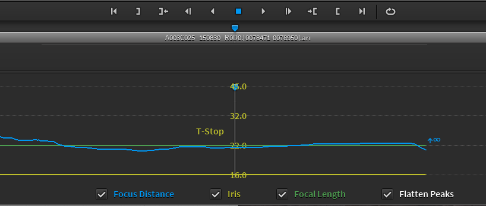
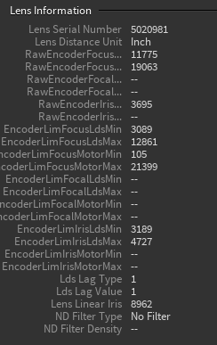

# Arri Meta Extract
Arri 카메라 메타데이터를 추출하는 툴입니다.
카메라 렌즈를 각 프레임마다 어떻게 조작했는지, 카메라 정보등을 추출할 수 있습니다.






정보는 csv로 추출됩니다. 
이 정보는 파이프라인툴에 넣는 툴을 제작하거나 또는 매치무브팀에 전달하고 활용할 시스템을 구축합니다.

## Arri Converter cmd 설치
```
$ cd ~/app
$ wget https://www.arri.com/resource/blob/31892/10a22fb2884539fa3d9fdeeb89ae026d/arri-meta-extract-cmd-3-5-3-3-cent-os-7-data.zip --no-check-certificate
$ unzip arri-meta-extract-cmd-3-5-3-3-cent-os-7-data.zip
$ rm arri-meta-extract-cmd-3-5-3-3-cent-os-7-data.zip
$ cd ARRI_Meta_Extract_CMD 3.5.3.3_Cent_OS_7
```
## 뉴크에서 사용할 수 있는 플러그인
- http://www.nukepedia.com/python/misc/arri-alexa-metadata-extraction-for-nuke

## 다운로드 페이지
https://www.arri.com/en/learn-help/learn-help-camera-system/tools/arri-meta-extract

## 실습
- LDS .csv 파일을 파이썬으로 파싱해보자.
- 원하는 수치를 뽑아볼 것

## Reference
- https://www.hdvideopro.com/blog/metadata-tool-to-uncover-the-facts/