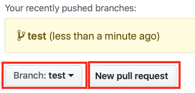
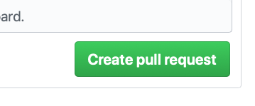

# 이슈관리와 코드제안(Pull Request)

프로젝트를 진행하다 보면 코드를 어떻게 협업해야하는지 모르는 분들이 많이 있습니다.
오늘은 코드관리툴에서 Pull Request 과정을 배워보겠습니다.

## 절 차
Git을 이용해서 협업하는 절차는 다음과 같습니다.
- Fork
- Upstream 등록
- 이슈선정
- 이슈로 브런치 생성
- 코드수정
- 코드제안
- 투표
- 코드합치기

## Fork

## Upstream

## 이슈선정

## 이슈로 브런치 생성

## 이슈 작성하기
개발을 하다보면 아무래도 이슈가 발생하기 마련입니다. 좋은 프로그램은 수많은 이슈를 처리해가면서 탄생하니까요.
최대한 다른 사람을 배려하는 글을 쓰는 습관을 들이는 것이 좋습니다. 필요에 따라서 이미지를 첨부하면 좋습니다.

CentOS7.6에서는 `Shift + PrintScreen` 키를 누르면 마우스로 드레그 영역을 지정하여 이미지 캡쳐를 할 수 있습니다.
저장되는 경로는 기본적으로 `~/Pictures` 폴더 입니다.

홈 디렉토리 경로에 `사진`이라는 폴더에 스크린샷 경로가 있다면
[홈디렉토리 설정을 영어로 바꾸는 문서](centos_home_kr2en.md)를 따라해주세요.

이슈가 많이 활성화 된 리포지토리 하나를 방문해보겠습니다. 어떤 이야기가 오고 가는지, 태그는 무엇을 사용하는지 관찰해보세요.

https://github.com/wesnoth/wesnoth/issues

## 코드수정

## 코드제안
이슈단계에서 많은 토론이 있더라도, 코드를 제안하는 단계에서는 더 치열하게 토론이 발생합니다.
보통은 메인테이너(리포지터리관리자)와 코드의 구조나, 이름, 최적화 등등으로 토론하게 되죠.

미리 코드를 짜기전에 이슈, 토론으로 해당 코드를 짠다고 이야기 후 진행하세요. 코드를 다 작성하고 PR이 허무하게 받아들여지지 않을 수 있으니까요. 이 점은 회사에 입사하더라도 비슷한 상황이 발생합니다.

Pull Request가 활발하게 일어나는 리포지터리 예제 링크.
코드가 충돌나거나 받아들여지지 않는 과정을 관찰해보세요.

https://github.com/wesnoth/wesnoth/pulls

## 투표
투표 방식은 간단합니다. 일반적으로 아래 패턴을 사용하게 됩니다.
- `+2`: 당신의 코드에 동의합니다.
- `+1`: 잘 모르겠지만 방향성에 대해서 동의합니다.
- `-2`: 당신의 코드에 동의하지 않습니다.

## 코드합치기
- Merge 버튼을 눌러서 코드를 합치게 됩니다.
- 최종 결정은 해당 리포지터리의 메인테이너가 합니다.

## 실습
- 강의노트를 fork 하고 수정, 이슈 제안을 해주세요.

1. 강의 노트를 Fork 합니다.
1. 홈 디렉토리에 Git clone 합니다.
```bash
$ cd ~
$ git clone https://github.com/{your_id}/curriculum
```

1. 소스코드가 다운로드 되면 폴더로 들어가서 upstream을 설정합니다.
```bash
$ cd curriculum
$ git remote add upstream https://github.com/cgiseminar/curriculum.git
```

1. 설정중에도 만약 최신코드가 있을지 모르니 fetch 합니다. fetch는 upstream에서 코드를 자동으로 머지하지 않습니다.(pull은 자동으로 머지합니다.)
```bash
$ git fetch upstream
```

1. 이슈,버그리스트를 보고 branch를 생성합니다.
```bash
$ git branch test
$ git branch
$ git checkout test
```

1. 소스 코드를 수정하고 수정된 내용을 확인합니다.
```
$ git diff
```

1. 수정된 파일을 test 브랜치에 add, commit, push 합니다.
```bash
$ git add filename
$ git commit -m "commit text"
$ git push origin test
```

1. Github에서 제안(PR)을 날립니다.



1. PR을 생성할 때 왜 코드를 수정했는지 이유를 꼭 적습니다.


1. 코드 검토자는 Files changed 탭을 클릭하고 변경 내용을 확인합니다.

1. 코드 제안이 받아 들여지면 master 브랜치로 이동하여 upstream에서 코드를 받습니다.
```bash
$ git checkout master
$ git branch
$ git pull upstream master
```

1. test 브랜치를 제거합니다.(현재 컴퓨터의 브랜치)
```bash
$ git branch -D test
```

1. 브랜치를 제거합니다.(깃허브의 브랜치)
```bash
$ git push --delete origin test
```

1. Fork한 리포지터리도 업데이트합니다.
```bash
$ git push origin master
```

1. gitk를 설치하고 관찰합니다.
```
# yum install gitk
```
