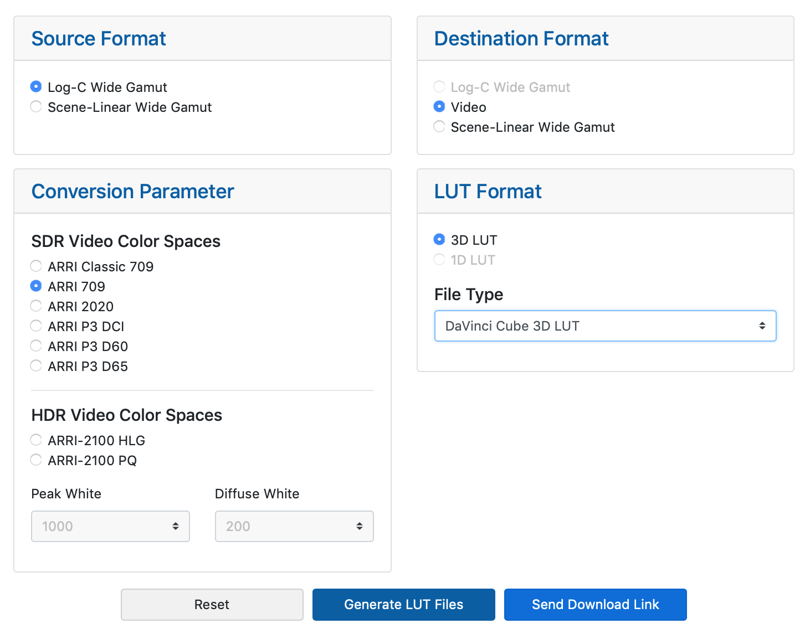

# Arri Lut Generater
수많은 영화는 Arri Alexa 카메라를 이용하여 촬영됩니다. 카메라에 사용되는 LUT를 다운로드 하는 방법을 알아보겠습니다.

예제로 Arri사의 Lut를 다운로드 하는 방법을 다루겠습니다.


> 참고 : 예전 회사에서 사용하던 LUT는 AlexaV3_K1S1 시리즈 였습니다. 최근 바뀐 Lut-generator에서는 이 LUT가 ALEXA Classic 709로 바뀌었습니다.



다운로드 페이지 : 
https://www.arri.com/en/learn-help/learn-help-camera-system/tools/lut-generator

최근 사이트가 리뉴얼되면서 버그로 인해서 실제로 Lut가 다운로드 되지 않습니다.(`18.12.11)

아래 명령어를 통해서 과거 Lut Generator를 통해 미리 받아두었던 파일을 활용해주세요.

```bash
$ cd ~
$ git clone https://github.com/cgiseminar/examples
$ cd examples/lut
```

실제로 프로젝트를 진행할 때는 각 콘텐츠마다 촬영된 카메라가 다릅니다.
따라서 프로젝트별로 Lut를 설정하여 뉴크를 사용하게 됩니다.

## Reference
- https://www.convergent-design.com/preset-luts
- http://indiecinerental.com/gammaluts.html