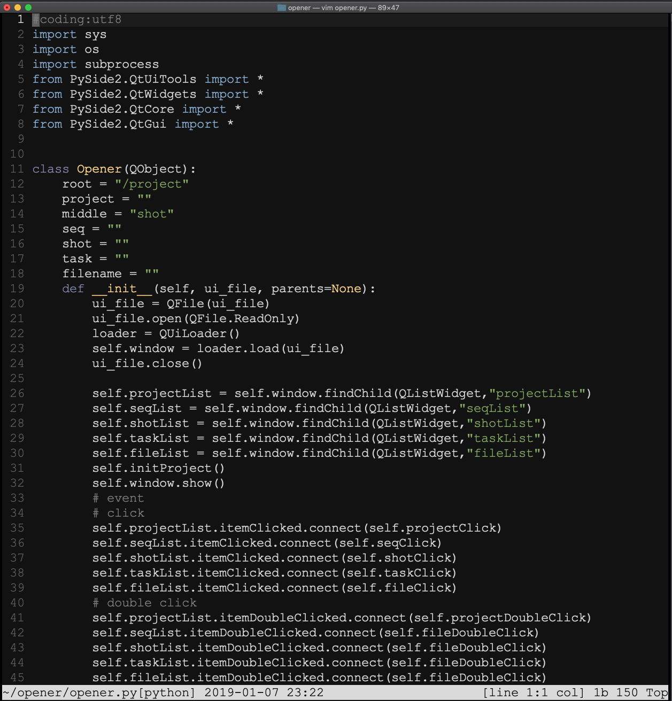
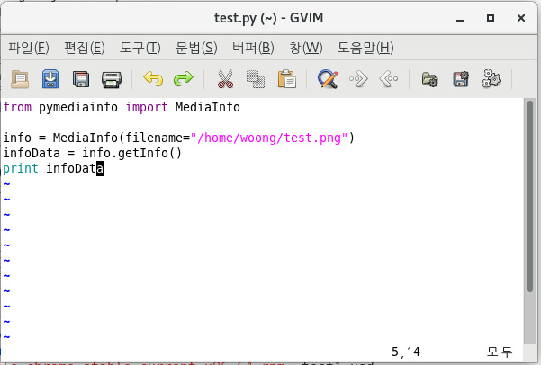
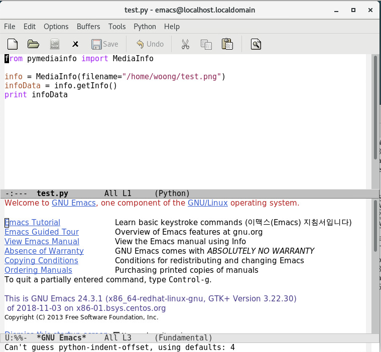
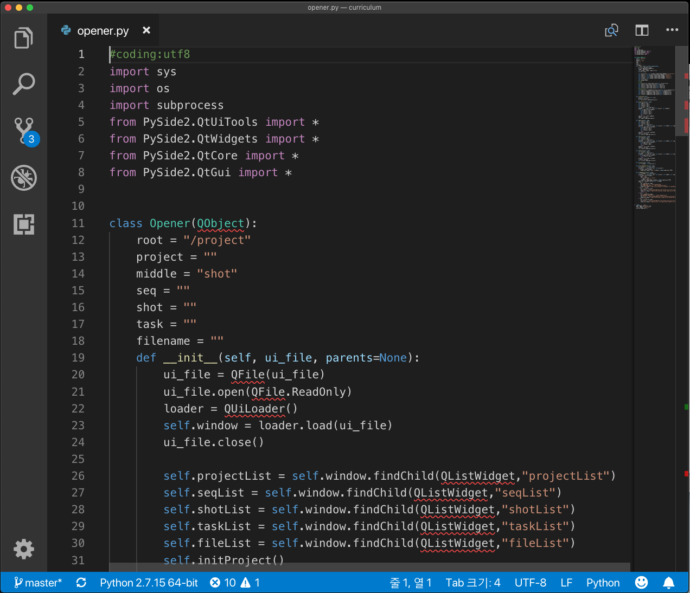
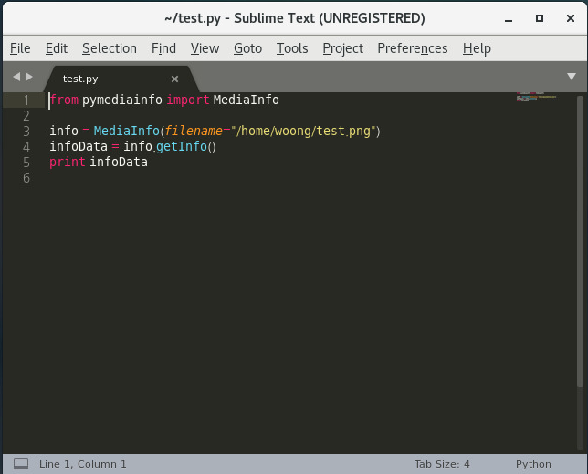
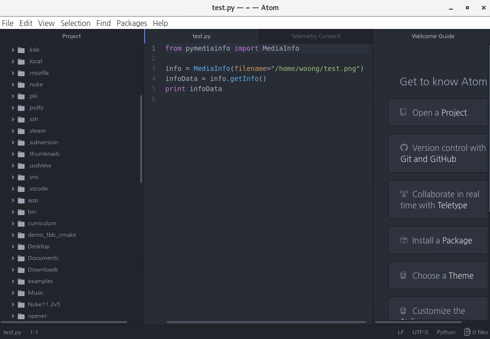

# Editor

리눅스에서 사용할 수 있는 에디터는 굉장히 많이 있습니다.
자신에게 맞는 에디터를 찾아보세요.
중요한 점은 프로젝트를 하는 모든 사람이 같은 에디터를 사용하는 것 입니다.
에디터를 통일해서 사용하면 노하우 및 셋팅을 공유하면서 팀, 조직이 강력해집니다.

기본적으로 리눅스에는 vi, vim, gedit 가 설치되어있습니다.

개인적으로 저는 Vim을 가장 즐겨 사용합니다. 클라우드 환경, ssh, 다른 서버등에서 에디터를 추가로 설치할 필요 없이 바로 사용할 수 있기 때문이예요. 하지만 에디터의 선택은 사람마다 기준이 다릅니다. 에디터를 선정하기 위한 회의를 해봅시다.

VSCode 에디터를 기본 에디터로 사용하겠습니다.

### vim


터미널에서 바로 사용할 수 있는 vim 에디터

### Gvim


```
# yum install gvim
```

### Emacs


```
# yum install emacs
```

### Visual Studio Code

Microsoft Visual Studio Code 설치


```bash
sudo rpm --import https://packages.microsoft.com/keys/microsoft.asc
sudo sh -c 'echo -e "[code]\nname=Visual Studio Code\nbaseurl=https://packages.microsoft.com/yumrepos/vscode\nenabled=1\ngpgcheck=1\ngpgkey=https://packages.microsoft.com/keys/microsoft.asc" > /etc/yum.repos.d/vscode.repo'
dnf check-update
sudo dnf install code
```

- https://code.visualstudio.com/docs/setup/linux

### Sublime



```
# rpm -v --import https://download.sublimetext.com/sublimehq-rpm-pub.gpg
# yum-config-manager --add-repo https://download.sublimetext.com/rpm/stable/x86_64/sublime-text.repo
# yum install sublime-text
```

### Atom
- 홈페이지 : https://atom.io/
- 소스코드 : https://github.com/atom/atom



```
$ cd /tmp
$ wget https://github.com/atom/atom/releases/download/v1.32.2/atom.x86_64.rpm
$ su
# yum localinstall atom.x86_64.rpm -y
```

### Webassembly.studio
아마도 미래에 .wasm 이 많이 사용되게 되면 에디터를 설치하지 않을 것 입니다.
그냥 웹브라우져에서 에디터를 이용하게 되겠죠!!

아직 많은 언어를 지원하진 않지만 webassembly로 만들어진 에디터를 아래 링크에서 살펴볼 수 있습니다.

https://webassembly.studio

## Reference
- Eclipse : https://www.itzgeek.com/how-tos/linux/centos-how-tos/install-eclipse-4-4-luna-ide-on-centos-7-rhel-7.html
- PyCharm : https://www.jetbrains.com/pycharm/
- Spacemacs : http://spacemacs.org