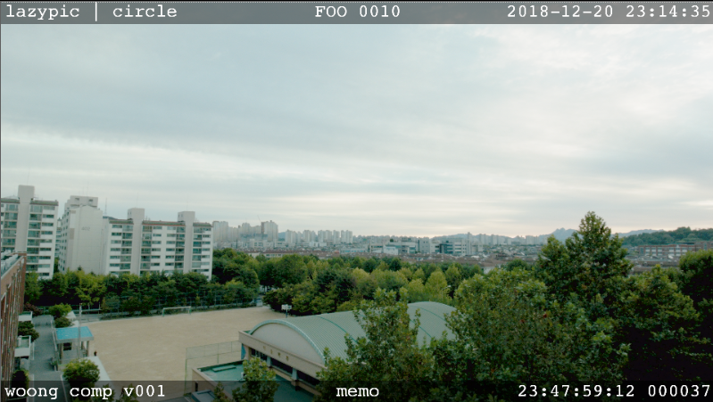

# 뉴크 Slate 기즈모 만들기

보통 콘텐츠를 추적, 관리하기 위해서 영상이미지에 정보를 번인하고 이것을 슬레이트라고 부릅니다.
보통 아래 정보들이 들어가도록 설계합니다. 각 조직마다 조금씩 다릅니다.

- 회사이름 : Vender명
- 프로젝트명
- 생성시간
- 샷이름
- Task
- 버전
- Username
- lut사용여부, 어떤 Lut를 사용했는가?
- 타임코드
- 메모할 노트
- 기타 필요정보
- 미디어ID : 회사에서 사용하는 고유한 미디어ID, 나중에 슬레이트를 보고 미디어를 역추적 해야하는 상황에서 사용하기도 합니다.
- Zero프레임 : 영상앞 1프레임에 디테일한 정보를 기록하는 것. mediainfo를 통해서 각 프레임갯수를 자동으로 세기 위해서 현재는 잘 사용하지 않습니다. 수많은 mov 파일을 모아서 전체 길이를 체크하는 프로그램등을 제작할 때 오차가 발생할 수 있기 때문입니다.

회사에 따라서는 위 정보가 DB에 저장되기도 하고 불러서 사용할 수 있는 구조를 만들기도 합니다. 수많은 정보를 관리한다는 것은 그만큼 유지, 보수할 정보도 많아진다는 뜻 입니다. 기업의 크기에 맞는 슬레이트 양식을 권장합니다.

보통 아래 이미지와 같은 형태를 띄게 됩니다.

일반적으로 자주 사용되는 슬레이트는 각 모서리위 위아래 중앙 부분에 정보를 입력하는 형태입니다.
이러한 정보를 입력해서 이미지로 변환하는 것을 Burn-in 이라고도 부릅니다.

뉴크에서 익스프레션을 토대로 슬레이트 기즈모를 제작해 보겠습니다.

- 상단 좌측 : 회사명, 프로젝트명
- 상단 중앙 : 샷이름
- 상단 우측 : 시간
- 하단 좌측 : 아티스트명, Task, 버전
    - 버전은 3자리로 표기하겠습니다. 간혹 수정이 100번을 넘길 수 있지만, 999번을 넘기기는 물리적으로 힘들테니까요.
- 하단 중앙 : 메모(아주 짧은 메모만 남길 수 있도록 하겠습니다.)
- 하단 우측 : 타임코드, 프레임
    - 우측하단의 프레임 포멧을 6자리로 표기해 봅시다. 이유는 3시간짜리 긴 영화여도 총 프레임수는 259200 프레임이라서 왠만한 영상 길이로는 6자리를 넘기지 않기 때문입니다.

## 실습
- 이미지 사이즈에 상관없는 가변형 슬레이트를 만들어 보겠습니다.
- 폰트사이즈를 조절할 수 있도록 제작해보겠습니다.
- 상,하,좌,우 여백을 설정할 수 있도록 하겠습니다.
- 총 6개의 영역에 원하는 정보를 입력할 수 있는 기즈모 Knob 옵션을 제작해보겠습니다.
- python을 이용해서 제작된 슬레이트 기즈모를 등록해보겠습니다.

## 응용
- 슬레이트는 비교적 간단하게 구현 가능합니다. 하지만 만든것을 깨달을 수 있습니다.
- 아이디어가 있다면 이미지 연산에 대해서 익스프레션과 파이썬을 사용해서 기즈모를 제작할 수 있습니다.