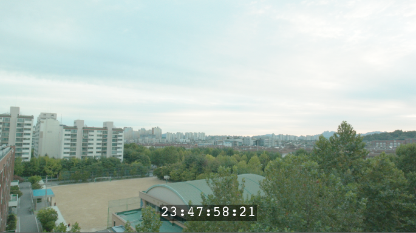

# Gizmo제작

뉴크에서 에셋을 만드는 방법중 하나입니다.
프로젝트에 자주 사용되는 노드그룹 또는 기능이 있다면 기즈모를 만들어서 수많은 아티스트가 활용할 수 있도록 기능을 뉴크에 추가할 수 있습니다.

뉴크 기즈모와 비슷한 개념
- 후디니 : HDA(Houdini Digital Asset), OTL(Operator Type Library)
- 언리얼 : 블루프린트를 이용한 에셋
- 3D툴 : 리깅이 적용된 에셋, 사용자 커스텀 값으로 결과가 바뀌는 셋팅

## Timecode 출력 기즈모 제작
가장 쉬운 기즈모부터 만드는 방법을 알아보겠습니다.

영상 작업시 소스의 정확한 구간(In,Out 포인트)을 커뮤니케이션 하기 위해서 가장 많이 사용하는 정보는 타임코드 정보입니다.

아래 이미지 처럼 보이는 뉴크 기즈모를 제작해보겠습니다.

이 기능을 제작하게 되면 아티스트는 편리하게 타임코드 정보를 Viewer에서 볼 수 있습니다.

## 실습
- 메타데이터에서 타임코드를 불러오기
- 이미지 사이즈가 너무 크거나 작아도 적당히 잘 보이는 타임코드 사이즈 설정
