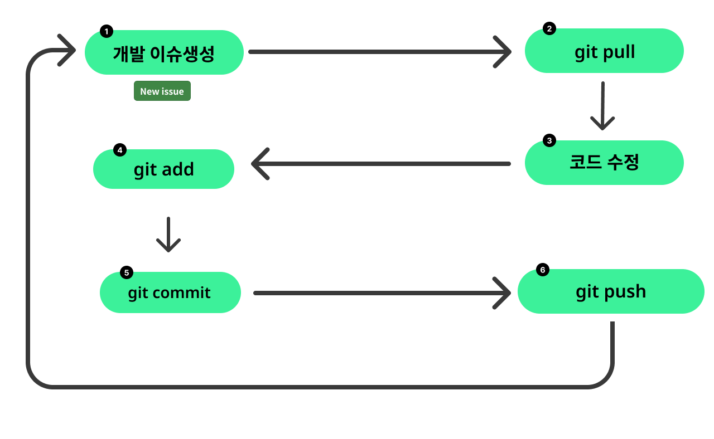

# Git 기초

Git은 버전 관리 시스템중 현재 가장 인기있는 툴입니다.
Git통해 코드를 버전관리 하게되면 에러에 대한 롤백, 협업이 가능해집니다.

## 기초 프로세스 (협업X)



## clone(필수)

리포지터리를 복제할 때 사용합니다.

```bash
git clone https://github.com/lazypic/OpenPipelineIO
```

## add(필수)

add 명령어는 파일의 변경 내용을 버전관리에 사용되는 Git 스테이징 영역(staging area)에 추가하기 위해서 사용하는 명령어 입니다.

```bash
git add edited.py
```

- `git add .` 와 `git add *` 의 차이점이 궁금하다면 이 [문서](https://atrystwithprogramming.wordpress.com/tag/git-add-vs-git-add/)를 보세요.

## commit(필수)

commit 명령어는 코드를 수정하고 메모를 남기기위해 서용하는 명령어 입니다. 최대한 잘 작성하면 나중에 코드를 돌릴 때 편하니 자세히 적는 습관을 들여주세요.
코드를 포함하여 주석, 메뉴얼 모두 버전관리 합니다. 이 내용은 Github를 사용했을 때 올라가며, 평생 남는 기록이 됩니다. 여러분의 지성을 뽐내주세요. :-)

```bash
git commit -m "나는 코드의 ~부분을 추가하거나 수정했다."
```

## push(필수)

로컬 저장소의 변경 내용을 원격 저장소로 전송하는 데 사용하는 명령어 입니다.

```bash
git push origin main
```

## init

Git을 사용하기 위해서는 최초 셋팅이 필요합니다.
개발 폴더로 들어가서 init 명령을 한번 실행해야 합니다.
만약 `git clone` 으로 소스 코드를가지고 왔다면 할 필요가 없습니다.
메인테이너가 최초 설정 및 배포하고 다른 구성원은 clone을 이용할 수 있도록 해주세요.

```bash
git init
```

명령어를 치고 나면 폴더에 `.git` 이라는 숨김폴더가 생깁니다.
이 디렉토리 안에는 환경설정, Git 버전관리에 필요한 파일이 생성되는 경로입니다.

## 협업 개발의 Process


# Error

## git pull시 신뢰할 수 없는 경로 에러

아래 에러가 발생하는 이유

```bash
fatal: detected dubious ownership in repository at '/repository/path'
...
git config --global --add safe.directory '%(prefix)/repository/path'
```

위 에러가 발생하는 이유는 Git이 해당 저장소의 소유권이 의심스럽다고 판단했기 때문입니다.
Git의 최신 버전에서 도입한 보안 기능의 일부로, 저장소의 소유권이나 권한 설정이 일반적이지 않거나 예상치 못한 상태일 때 발생합니다.

`git config --global --add safe.directory '%(prefix)/repository/path'` 이라는 메시지는 Git이 사용자에게 이 경로를 안전한 디렉토리 목록에 추가하도록 권장하는 명령어 입니다. 보안에 문제가 되지 않는다면 파이핑해서 안전한 디렉토리로 등록해주세요.


## 윈도우즈 CRLF 에러 처리

warning: in the working copy of 'edit.sh', LF will be replaced by CRLF the next time Git touches it 에러 발생시 아래처럼 타이핑한다.

- 발생하는 이유: 위 경고 메시지는 Git을 Windows 환경에서 사용할 때 발생하는 것이며, 주로 줄 끝 표시 (Line Ending)에 관련된 문제를 나타냅니다. 이 경고 메시지의 이유와 해결 방법은 아래와 같습니다.

- 줄 끝 표시 (Line Ending) 차이:
  - Unix/Linux 환경에서는 줄 끝을 나타낼 때 LF (Line Feed) 문자를 사용합니다.
  - Windows 환경에서는 줄 끝을 나타낼 때 CR (Carriage Return)과 LF (Line Feed) 문자, 즉 CRLF (Carriage Return Line Feed) 문자를 사용합니다.

- Git의 동작:
  - Git은 파일을 저장할 때 해당 운영 체제 환경에 따라 줄 끝 표시를 저장합니다.
  - 그러나 Windows 환경에서 Git을 사용할 때, Git이 저장소에 있는 파일을 가져올 때 LF로 끝나는 줄 끝 표시를 CRLF로 변환합니다. 이렇게 하는 이유는 Windows가 CRLF 줄 끝 표시를 기대하기 때문입니다.
- 경고 메시지의 의미:
  - 경고 메시지는 Git이 해당 파일을 다룰 때 (예: commit, checkout 등) 줄 끝 표시를 변경할 것임을 알려줍니다.
  - 즉, "edit.sh" 파일은 현재 LF로 끝나는 줄 끝 표시를 가지고 있지만, Git이 다음에 이 파일을 다룰 때 CRLF로 변환될 것입니다.

### 해결방법

이 경고 메시지는 주로 Windows 사용자와 Unix/Linux 사용자 간의 협업 시에 발생하며, 줄 끝 표시에 관한 문제를 방지하기 위해 다음과 같은 해결 방법이 있습니다.

#### 방법1: `.gitattributes` 처리법

`.gitattributes` 파일을 루트 디렉토리에 추가하고 아래처럼 추가합니다.

```
* text=auto
```

이렇게 설정하면 Git이 자동으로 줄 끝 표시를 관리하게 됩니다.

#### 방법2: Git 설정 변경

Git의 core.autocrlf 설정을 변경하여 이러한 경고를 제거할 수도 있습니다. 다음 명령을 실행하여 설정을 변경합니다.

```bash
git config --global core.autocrlf true # Windows 사용자
git config --global core.autocrlf input # Unix/Linux 사용자
```

주의: `--global` 플래그를 사용하면 전역 설정이 변경되므로 주의해야 합니다.

## 나머지 명령어들에 대해서..

사실 Git은 초심자에게 조금 복잡하지만,
나머지 명령어는 함께 협업을 하거나 Github를 연동하면서 천천히 배워간다면 그리 어렵지 않습니다.
개발을 하며 상황이 발생했을 때 함께 익혀갑시다.

## Reference

- Git 학습하는 책중에는 [Pro Git](https://progit2.s3.amazonaws.com/ko/2015-07-08-5c390/progit-ko.582.pdf) E-book이 가장 유명합니다.
