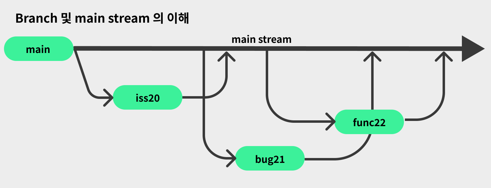

# Git branch

## Branch

Git branch 관리에 대해 설명합니다.



개발이슈가 발생하면 이슈를 생성하고 해당 이슈로 브랜치를 만들어서 코드를 작성합니다.
main 스트림은 관리만 진행하고 직접 main 스트림에서 코드를 건드리지 않습니다.
실제 코드는 가급적 만들어진 branch에서만 작성해주세요.

브랜치명은 보통 아래 이름으로 많이 만들어집니다.

- 이슈 번호
- 버그 번호
- 패치 번호

```bash
git pull
git branch iss20
git checkout iss20
<< 코드 작성 >>
git checkout main
git pull origin main
```


#### 세부 교육 내용

- 협업을 위해 개발자끼리 약속해야할 것!: `우리 main stream은 건드리지 말자! 우리는 꼭 브런치를 만들고 각자의 개발자가 테스트하고 문제가 없을 때만 merge 하자~!`
- Github에서 branch 리스트 보는 방법: [OpenColorIO사례](https://github.com/AcademySoftwareFoundation/OpenColorIO)
- Git의 Content-addressable 파일 시스템 설명하기
| Key | Value |
| ------------- | ------------- |
| 5e1c4447a691fa0b687f502a65c3c1ff792033f9 | 변경사항만 저장 |


## Upstream setting

- 개발하고 싶은 리포지터리를 fork 합니다.
- fork 한 리포지터리를 clone 합니다.
- 사용예시

```bash
git remote add https://github.com/lazypic/OpenPipelineIO
```
