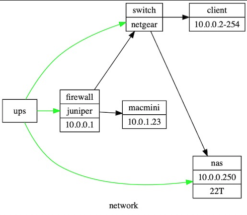

# GraphViz
간단하게 그래프를 그릴 때 사용합니다.
- 홈페이지 : https://www.graphviz.org

```
# yum install graphviz
```



test.dot
```
digraph g {
label="network";
rankdir=LR;
nodesep=1.5;
weight=0.5;

"firewall" [
label = "firewall | juniper | 10.0.0.1"
shape = "record"
];

"ups" [
label = "ups"
shape = "record"
];

"switch" [
label = "switch | netgear"
shape = "record"
];

"nas" [
label = "nas | 10.0.0.250 | 22T"
shape = "record"
];

"client" [
label = "client | 10.0.0.2-254"
shape = "record"
];

"macmini" [
label = "macmini | 10.0.1.23"
shape = "record"
];

"firewall" -> "switch";
"firewall" -> "macmini";
"switch" -> "nas";
"switch" -> "client";
"ups" -> "firewall" [color="green"];
"ups" -> "nas" [color="green"];
"ups" -> "switch" [color="green"];
}
```

```bash
$ dot -Tjpg test.dot -o test.jpg
```

## 실습
- graphviz를 설치하고 모양을 만들어보세요.
- 자동 설치툴을 제작해보세요.