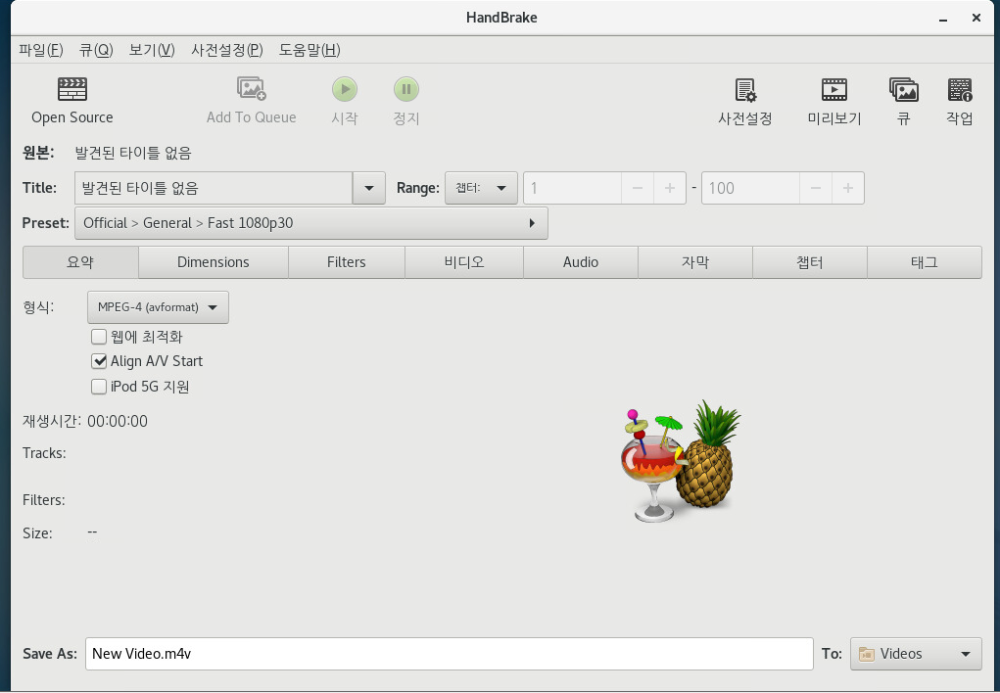

# Handbrake
오픈소스 비디오 변환툴입니다.

## 설치
~/app 폴더에 handbrake를 설치해 보겠습니다.

HandbrakeCLI를 컴파일하기 위해서 필요한 라이브러리를 먼저 설치합니다.

```
$ su
# yum update
# yum groupinstall "Development Tools" "Additional Development"
# yum install fribidi-devel git jansson-devel libogg-devel libsamplerate-devel libtheora-devel libvorbis-devel opus-devel
# yum install libass-devel yasm
# yum repo-pkgs zmrepo remove
# yum remove zmrepo #lame-devel,x264-devel 를 zmrepo에서 가지고 오지 않도록 하기위해서 제거합니다.
# yum localinstall --nogpgcheck https://download1.rpmfusion.org/free/el/rpmfusion-free-release-7.noarch.rpm
# yum install lame-devel x264-devel
```

소스코드를 받고 컴파일 후 설치하겠습니다.

```bash
$ cd ~/app
$ git clone https://github.com/HandBrake/HandBrake.git
$ cd HandBrake
$ git tag --list | grep ^1\.1\.
$ git checkout refs/tags/$(git tag -l | grep -E '^1\.1\.[0-9]+$' | tail -n 1)
$ ./configure --launch-jobs=$(nproc) --launch
# make --directory=build install
$ rm -rf build
```
`$(nproc)` 는 CPU갯수(number of process) 입니다.
설치가 완료되면 `HandBrakeCLI` 명령어를 사용할 수 있습니다.

```bash
$ HandBrakeCLI -help
```



프로그램 > 음악과 비디오 > HandBrake 를 클릭하여 GUI 프로그램도 실행할 수 있습니다.

## 사용법

일반적인 사용법은 아래와 같습니다.

```bash
$ HandBrakeCLI -i source -o destination
```

개인적으로 프로젝트를 진행할 때는 HandBrake GUI버전으로 테스트를 하고 이후 Preset 파일이 나오면 나중에 `--preset-import-file` 옵션을 이용해서 프리셋 파일을 HandBrakeCLI에 import 하여 사용합니다. HandBrake의 프리셋 파일은 json 포멧을 사용합니다. 실무에서는 보통 아래처럼 사용하는 경우가 많습니다.

```bash
$ HandBrakeCLI -i source --preset-import-file presetfile.json -o destination
```

- CentOS가 설치되면 자동으로 Handbrake가 설치되도록 스크립트 작성하기

## Reference
영상을 올릴때 특정 코덱, 형식등을 제한하여 업로드 하는 서비스를 만날 때 사용합니다.

- https://handbrake.fr/docs/en/1.1.0/developer/build-linux.html
- https://handbrake.fr/docs/en/1.1.0/cli/cli-guide.html
- 개발 제품 데모를 만들때 동영상 셋팅 제안문서(블렌더 마켓) : https://blendermarket.com/posts/reduce-the-size-of-your-training-videos
