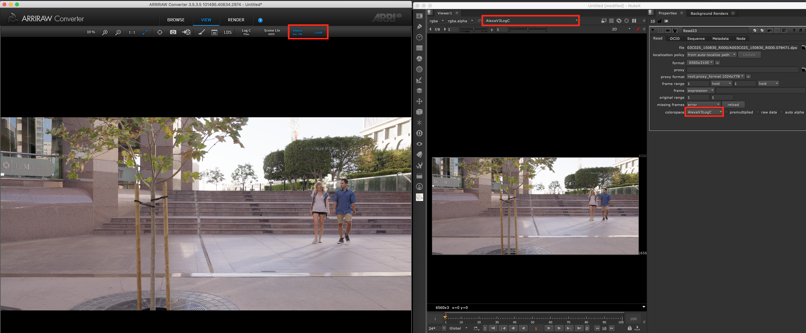
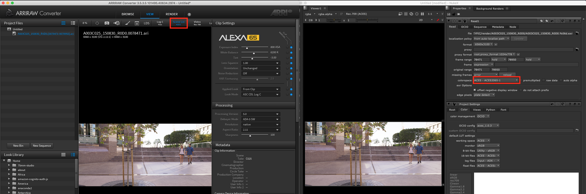

# 컬러스페이스의 역사

앞으로 우리가 자주 다루게 될 ACES, OpenColorIO, OpenImageIO 를 설명하거나 설치하기 전에 컬러스페이스의 역사부터 설명하겠습니다.

인류 역사상 컴퓨터가 사용된 것은 그리 오래되지 않았습니다.
컬러스페이스는 최근에 만들어진 기술입니다.

과거 화가들은 몇가지의 색상을 가지고 혼합하여 자신이 원하는 색상을 만들어냈습니다.
이때부터 인류는 어떻게 하면 항상 같은 컬러를 만들 수 있을지 고민하기 시작했을 것 입니다.

점점 인류의 문명이 발전하고 산업화 되면서 컬러 제조가 중요해질 때는 아마도 컬러 인쇄물을 만들 때 부터 시작됩니다.
"C,M,Y,K 잉크를 가지고 어떻게 우리가 원하는 색을 항상 같도록 어떻게 만들 수 있을까?" 같은 고민들이 시작이었습니다.

인쇄를 위한 빨간색을 만들기 위해서는 (C,M,Y,K) 컬러스페이스를 사용합니다.
각각의 값이 최소값이 0, 최대값이 1이라는 가정하에 마젠타(M), 옐로우(Y) 가 모두 1이면 빨간색을 만들 수 있습니다.
마젠타 컬러와 옐로우 컬러를 섞으면 빨강이 되죠.

그 다음은 흑백으로 촬영할 수 있는 카메라와 흑백 디스플레이 장치들이 만들어집니다.
흑백(그레이스케일)은 컬러를 흰색과 블랙으로만 표현하는 컬러스페이스 입니다.
이때까지만 해도 컬러의 개념이 그리 복잡하지 않았습니다.

이후 시간이 흐르고 컬러로 촬영할 수 있는 카메라, 컬러TV, 컬러 모니터가 만들어집니다.

시장에서 문제점은 이미 흑백TV를 가진사람과 컬러TV를 구매한 사람이 같이 존재한다는 것 입니다.

흑백을 가진 사람은 명도밖에 볼 수 없습니다.
컬러를 (H,S,V) 형태의 모델로 바꾸어서 시청자가 흑백디스플레이를 가지고 있다면 H,S값을 무시하고 V값만 전송받고, 컬러라면 (H,S,V)값을 전부 전송받아서 재생하던 시기도 있었죠.
요즘 우리가 사용하는 모니터인 (R,G,B) 모델도 역사적으로는 최근에 사용된 모델입니다.

천천히 시간이 흐르고 모든 사람들이 컬러 디스플레이 제품을 가지게 될 때쯤 RGB 개념의 컬러스페이스들은 시장에서 익숙해집니다.

처음 RGB의 컬러를 저장할 때는 16컬러에서 시작해서 각 채널당 256색으로 저장했어요.


이 당시 ADOBE 포토샵도 발전하며 작업을 위한 컬러스페이스를 자체적으로 만들 때 입니다. Adobe RGB, sRGB 같은 컬러스페이스가 제작됩니다.

이후 Adobe는 자체적으로 아래 리스트에 보이는 형태의 컬러스페이스들이 만들어집니다.


슬슬 세상이 복잡해집니다. 이 회사 저회사 전부 컬러스페이스를 따로 만들기 시작했습니다.

디지털 시네마 기술도 발전하여 코닥은 필름을 스캔하여 디지털로 변환하는 작업을 할 수 있는 장치를 발명했습니다.
그리고 그 장치는 필름을 .cin 파일로 저장했습니다.
.cin파일이 저장될 때 이미지의 디테일을 잘 저장하기 위해서 흰색의 밝기를 낮추고, 암부를 조금 밝게 저장하는 형식의 log 컬러스페이스가 영화에서 많이 사용되었습니다.


과거 작업자는 필름이 스캔된 이미지를 불러서 log2lin 후 작업하고 lin2log로 저장해야 했습니다.

로그로 촬영하는 이유는 사람의 눈은 어두운곳에 더 민감하게 반응하도록 되어있습니다.
카메라 센서는 linear로 작동되게 되어있어요.
그래서 카메라에게 암부를 민감하게 찍고, 밝은 부분은 정보가 덜 민감하게 찍어달라고 감마 설정하는 것 입니다. 이 감마의 모양은 Log곡선과 비슷해서 로그촬영이라고 합니다.

아래 이미지는 쉐이크라는 과거에 사용된 합성툴 스크린 샷 입니다. 툴 기능중 조그맣게 LogLin 이라고 하는 기능이 보이나요?


과거 합성을 할 때는 이런 기능의 사용이 일반화 되었지만 필름이 거의 사라진 현대  영화 합성에서는 많이 사용되지 않습니다.

나중에는 .cin 파일이 좀더 발전하여 파일에 추가적으로 사용자가 활용할 수 있는 정보(메타데이터)를 담을 수 있는 .dpx가 탄생되었죠.

시간이 지남에 따라서 디지털 카메라도 점점 발전을 거듭하며 과거보다 더 많은 비트수와 정보를 저장할 수 있게 됩니다.
또한 카메라 제조사가 직접 자신의 카메라에 맞는 컬러스페이스, gamut을 제작하기도 합니다.

- 파나비전의 Panalog
- 레드사의 REDLog, REDSpace
- ViperLog
- Arri사의 AlexaV3LogC
- 소니의 SLog, SLog1, SLog2 ...
- 캐논의 CLog
- Protune
- 파나소닉의 VLog
- 블랙매직사의 Blackmagic Log
- Technicolor CineStyle
- Magic Lantern RAW

등등이 시장에서 등장합니다. 각 회사가 장비를 매번 만들 때마다 Colorspace 또는 Gamut은 시장에 점점 늘어나게 됩니다. 하드웨어의 성능이 좋아지면서 좀더 많은 계조, 해상도, 노출정보들도 이미지에 담기게 됩니다.

한편으로 과거의 유물인 LogLin 역시 시간이 지나 사라지지 않고 검정,흰색을 이용하여 연산하지만 회색 단색을 이용해서 LogLin을 하는 [PLogLin](https://learn.foundry.com/nuke/content/reference_guide/color_nodes/ploglin.html)형태가  추가적으로 발전되기도 합니다.

시장에서 표준없이 이미지를 저장할때 컬러 관련된 Colorspace, Gamut, 촬영방식 등이 무분별하게 늘어나는것은 아티스트, 개발자 모두에게 좋지않습니다. 매번 작업을 복잡하게 만들고 프로젝트를 진행할 때 프로젝트 셋팅이 복잡해집니다.

컬러를 다루는 관련 업계의 사람들이 영상 후반 작업을 할 때 너무 불편해서 회의를 시작했습니다.

```
"표준 컬러매니징 시스템을 만들면 좋겠어!"
"이대로 두면 세상은 매번 컬러를 처리할 때 굉장히 복잡해질꺼야!"
"같이 사용할 수 있는 컬러메니징 시스템을 만들어보자!!"
```

이러한 노력끝에 ACES / OpenColorIO 컬러 매니지먼트 툴이 개발되기 시작합니다.
근래에는 많은 프로젝트가 ACES 기반으로 작업이 많이 되어지고 있습니다.
여러분이 실무작업에 몸담게 되는 미래에는 더욱 많이 사용되겠지요.


위 이미지는 Arri Converter를 이용해서 DPX를 LogC 컬러스페이스로 설정한 값과 뉴크 뷰어의 비교이미지 입니다. 이런 방식으로 영화가 작업되기도 합니다. 한편으로는 아래처럼 작업할 수도 있습니다.


Arri Converter 에서 ACES로 이미지를 출력합니다. 이후 뉴크에서 ACES 셋팅후 작업을 하는 것 입니다.
물론 뉴크 뿐만아니라 다른 그래픽스툴이 ACES를 지원한다면, 항상 같은 컬러를 볼 수 있답니다.

앞으로 컬러매니징을 위해서 ACES, OpenColorIO, OpenImageIO를 다루어볼 예정입니다.

## 실습
- 8bit sRGB 파일을 뉴크에서 로딩, 설명
- dpx파일을 뉴크에서 로딩. 설명
- dpx파일을 뉴크에서 로딩, Lut적용하기
- ACES exr을 뉴크에서 로딩, 설명하기

#### Reference
- http://vfxcamdb.com/color-spaces/
- https://www.rocketstock.com/blog/tips-for-log-color-space-compositing/