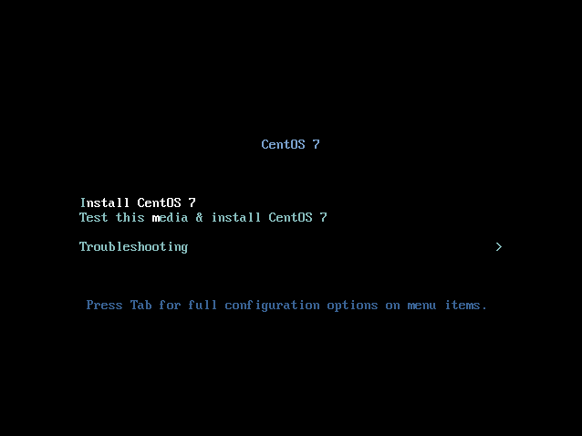
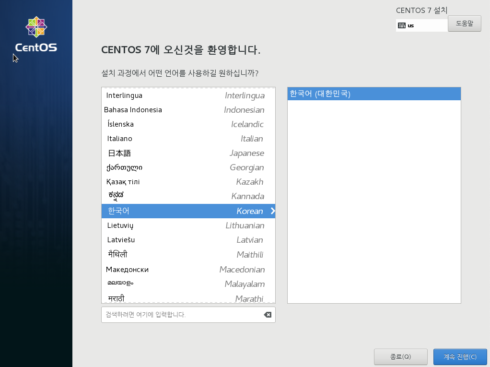
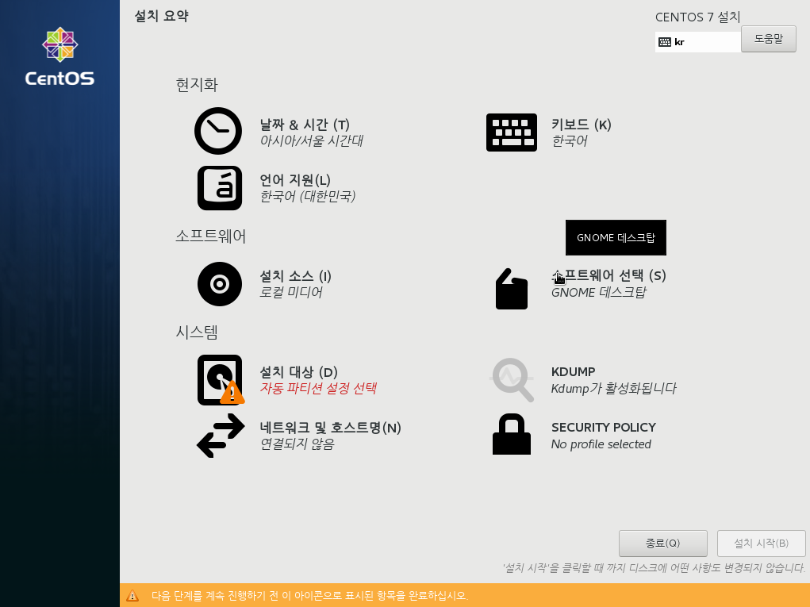
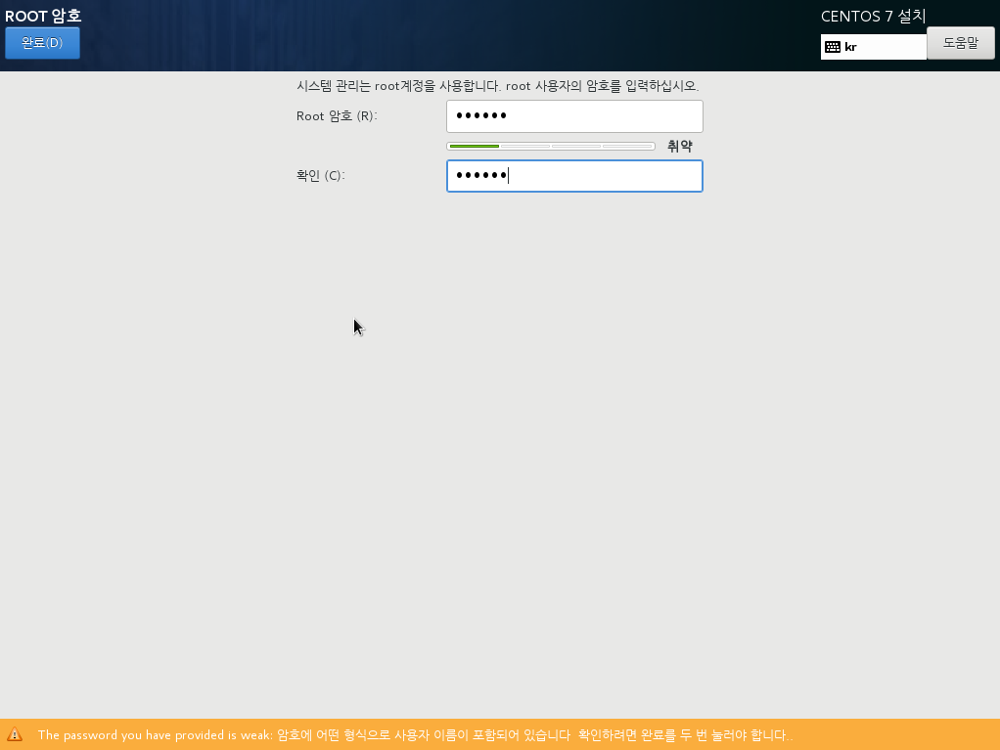
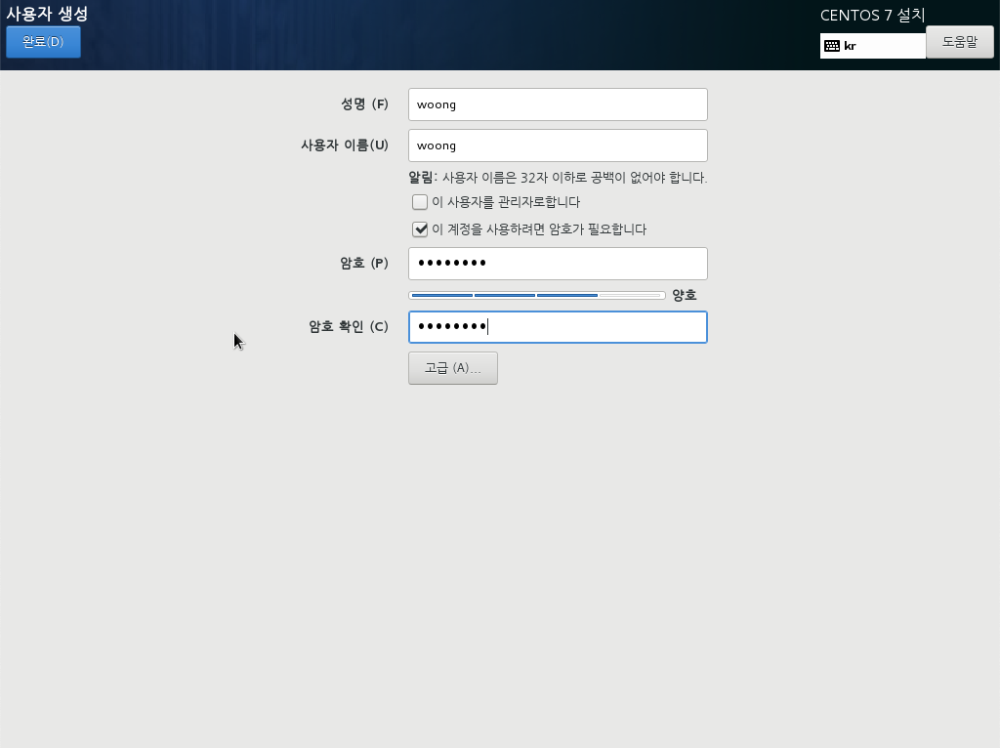
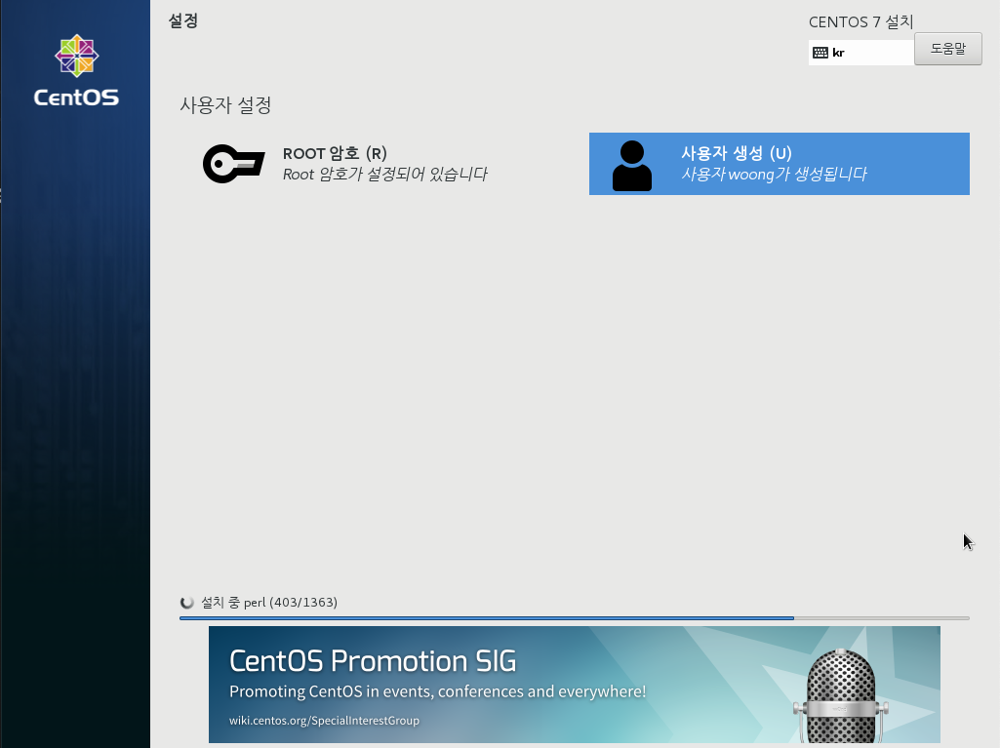
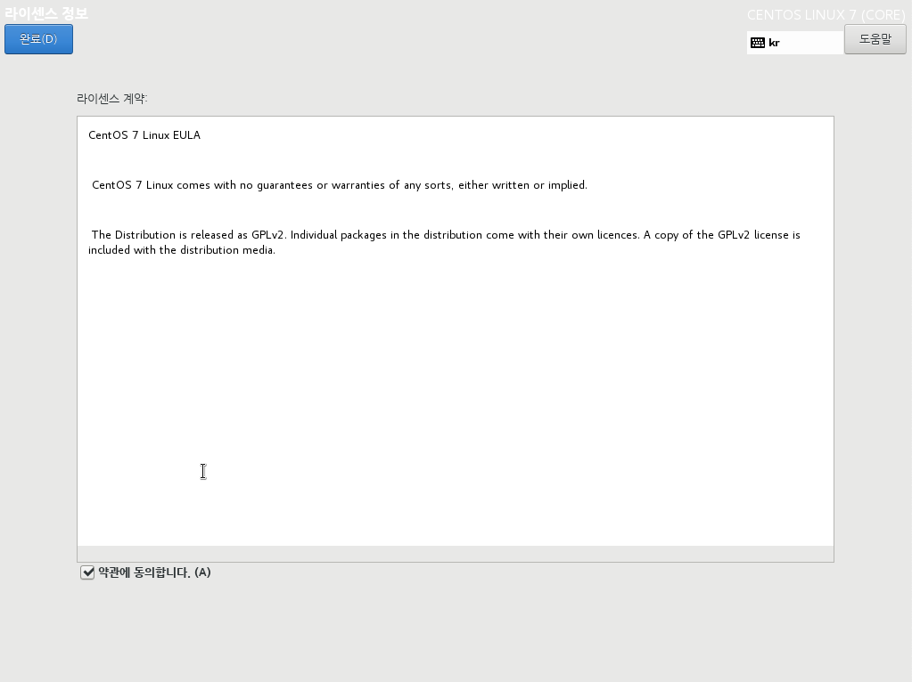

# install CentOS
CentOS7.6을 설치해보겠습니다.

## 이미지 다운로드
- CentOS 이미지를 다운로드 받습니다.
- https://www.centos.org/download/
- CentOS를 사용하는 이유 : https://www.foundry.com/products/nuke/requirements
- 강의실에서는 다른 수업의 경우 윈도우로 진행하기 때문에 리눅스 설치시 멀티 부팅을 할 수 있도록 설치합니다.
- 강의실 Root 패스워드는 추후 관리를 위해서 `imroot`로 통일해주세요.
- 강의실에서 부팅을 USB로 하기 위해서는 Bios 패스워드가 필요합니다.

## 부팅 USB 만들기

#### .iso to USB (windows)


윈도우즈에서 리눅스 부팅 usb를 제작하기 위해서는 rufus 유틸리티가 필요합니다. 아래 링크에서 다운로드 합니다.
- https://rufus.ie/ko_KR.html

#### .iso to USB (macOS)
- 다운받은 .iso파일을 .img로 바꾸어줘야하는 작업이 필요합니다.
```
$ hdiutil convert -format UDRW -o ~/Downloads/CentOS-7-x86_64-Everything-2009.img ~/Downloads/CentOS-7-x86_64-Everything-2009.iso
```

- 변환된 파일은 .dmg 확장자가 붙습니다. mv명령어를 통해서 제거합니다.
```
$ mv ~/Downloads/CentOS-7-x86_64-Everything-2009.img.dmg ~/Downloads/CentOS-7-x86_64-Everything-2009.img
```

- USB의 이름을 확인합니다.
```
$ diskutil list
```

- 제 컴퓨터에서는 disk2 로 출력되었습니다. 컴퓨터마다 다를 수 있습니다.

```
$ sudo umount /dev/disk2
$ sudo diskutil unmountDisk disk2 # 만약 Resource busy가 뜨면 타이핑해주세요.
$ sudo dd if=~/Downloads/CentOS-7-x86_64-Everything-2009.img of=/dev/rdisk2 bs=1m
```
- 잘 진행이 되면 아래 메시지를 출력후 종료됩니다.
```
8961+1 records in
8961+1 records out
9396461568 bytes transferred in 706.427948 secs (13301373 bytes/sec)
```

- USB를 추출합니다.
```
$ diskutil eject /dev/disk2
Disk /dev/disk2 ejected
```


## Windows10
강의실에는 Windows10이 설치되어 있습니다.
Windows10이 깔려있는 하드디스크에 리눅스를 설치하는 것은 모팩아카데미와 측에서 권장하지 않습니다.
준비된 SSD 하드디스크를 시스템에 장착하고 리눅스 설치를 진행합니다.

## CentOS 설치
- 준비물 : 하드디스크, CentOS USB 이미지를 준비합니다.
- 부팅시 F9를 눌러서 USB로 부팅할 수 있도록 해주세요. 바이오스 패스워드는 강의실에서 공유합니다.



Test this media & install CentOS7을 선택합니다. 이미지가 문제가 없는지 체크하는 과정이 있습니다.



언어를 선택합니다.



소프트웨어 선택에 들어가서 GNOME 데스크탑을 선택합니다.


설치 대상에서 설치할 하드디스크를 선택합니다.



설치가 진행됩니다.
설치중에 Root 사용자, 일반 사용자의 계정을 만들 수 있습니다.



루트 사용자 패스워드를 설정해주세요. 관리를 위해서 `imroot`로 입력해주세요.



사용자 생성을 진행합니다. 자신이 사용할 이름과 패스워드를 설정해주세요.

설치가 끝나면 재부팅을 하게 됩니다.



재부팅 이후 라이센스 약관동의 창이 뜹니다.

## 바이오스 셋팅
1. F10을 눌러서 바이오스에 들어갑니다.
1. Storage > Boot Order
1. SSD 하드의 순서를 위로 올려줍니다.
1. F10을 눌러서 설정을 마칩니다.
1. File > Save Changes and Exit 를 눌러줍니다.


## Referenece
- http://www.advancedclustering.com/act_kb/installing-nvidia-drivers-rhel-centos-7
- http://thrillfighter.tistory.com/618
- http://eeingee.tistory.com/1
