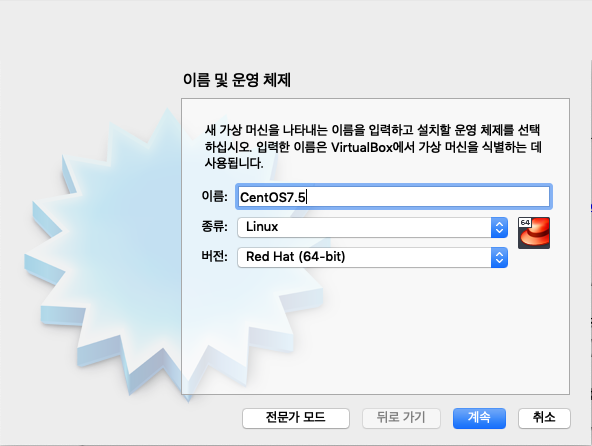
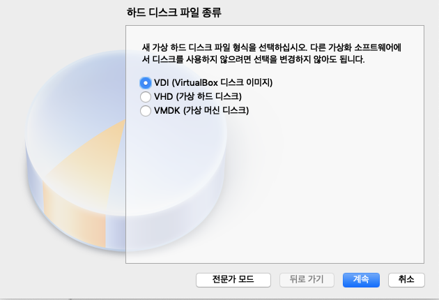
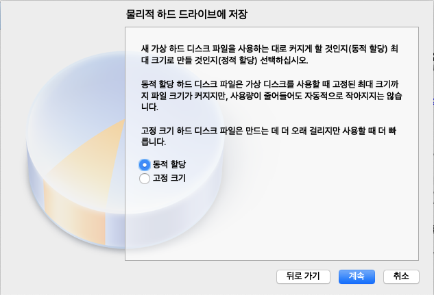
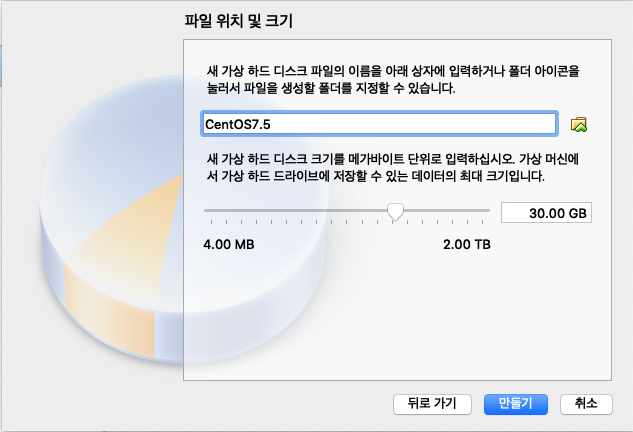
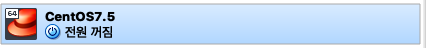
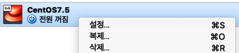
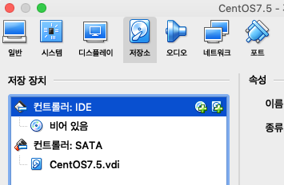
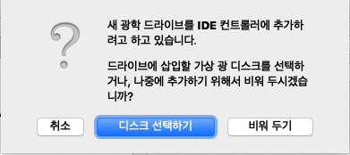
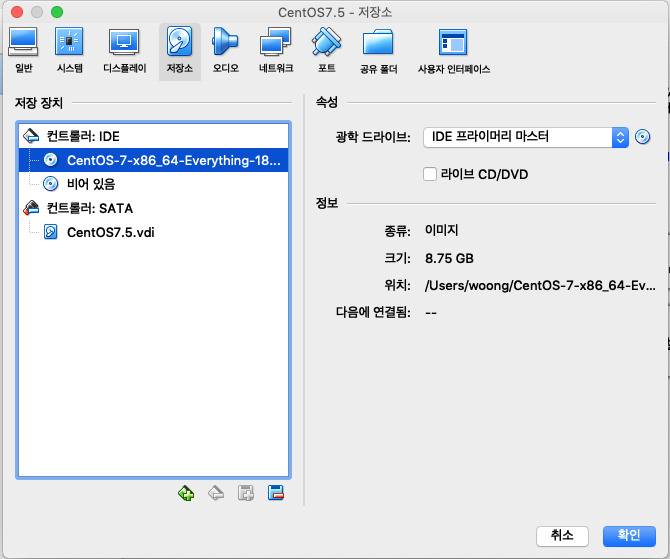

# 가상 환경에서 CentOS7 설치하기

VirtualBox에 CentOS7.5를 설치해보겠습니다.

## 이미지 다운로드
- CentOS 이미지를 다운로드 받습니다.
- https://www.centos.org/download/
- CentOS를 사용하는 이유 : https://www.foundry.com/products/nuke/requirements

## VirtualBox 다운로드
- VirtualBox 다운로드 페이지 : https://www.virtualbox.org/wiki/Downloads
- 

## 설치중 설정사항
- 강의실 Root 패스워드는 추후 관리를 위해서 `imroot`로 통일해주세요.

## 설치

새로 만들기를 클릭합니다.

이름을 설정해 주세요.

대부분 시간을 리눅스에서 보냅니다. 메모리는 허용가능한 상태에서 최대로 잡아주세요.

새 가상 하드 디스크를 만듭니다.

기본을 선택합니다.

동적할당을 선택합니다.

우리가 사용하는 예제 파일을 제외하고 모든 컴파일을 진행하면 약 12G 정도가 사용됩니다. 테스트를 포함하여 30G를 잡습니다.

CentOS7.5 아이콘이 생성되었습니다.

마우스 오른쪽 버튼을 눌러서 설정으로 들어가주세요.

저장소 > CD모양의 + 아이콘을 클릭합니다.

디스크 선택하기를 눌러주세요.

우리가 다운로드 받은 CentOS7.5 iso 이미지를 선택합니다.

시작을 누르면 CentOS 설치가 시작됩니다.

## VirtualBox Extension Pack 설치
그냥 사용하면 제한된 해상도에서만 사용가능합니다.

- https://download.virtualbox.org/virtualbox/5.2.22/Oracle_VM_VirtualBox_Extension_Pack-5.2.22.vbox-extpack

다운로드 받고 더블클릭하면 VirtualBox가 실행되며 설치 여부를 묻습니다.

https://extrememanual.net/8844