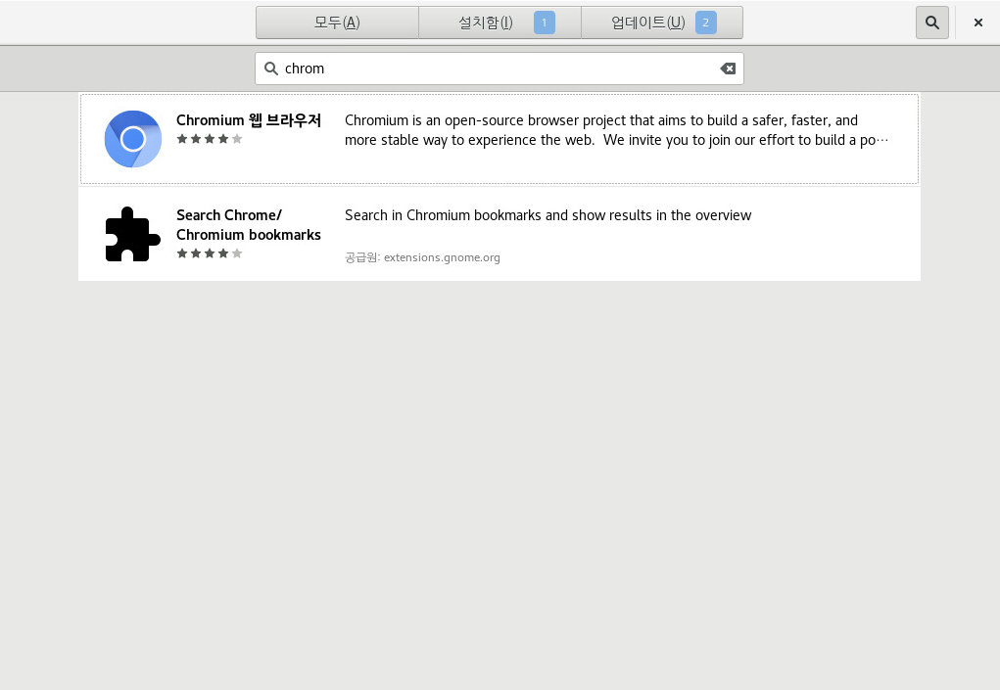

# 크롬설치
구글 크롬 브라우저를 설치해보겠습니다.
구글 서비스중에서 크롬에서 잘 작동되는 기능들이 많기 때문에 편의상 설치하면 좋습니다.

크롬 rpm을 wget을 통해서 다운로드 받습니다.
```
$ wget https://dl.google.com/linux/direct/google-chrome-stable_current_x86_64.rpm
```

관리자로 변경하여 yum 을 이용해서 rpm을 설치합니다. 자동으로 의존성을 처리해줍니다.
```
# yum localinstall google-chrome-stable_current_x86_64.rpm
```

# 크로미움 설치
Chromium 소스코드에서 크롬이 탄생한 역사를 가지고 있습니다. 크롬의 조상쯤 됩니다.
간단하게 설치하고 싶을 때 개인적으로 사용합니다. 또한 구글에게 개인정보를 보내지 않습니다.

프로그램 > 즐겨찾기 > 응용프로그램 설치에서 설치가능합니다. 개인적으로 크롬을 쓰고 싶을때 설치가 쉬워서 크로미움 브라우저를 사용합니다.




## Reference
http://www.itworld.co.kr/news/108483