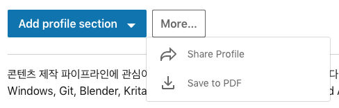

# linkedin
linkedin 가입 및 이력서 작성준비를 시작합니다.

이력서는 이슈가 발생할 때 마다 작성하는 것이 좋습니다.
한순간 작성하려고 하면 막상 관련된 내용들이 생각나지 않거든요.

Github와 Linkedin을 같이 가입하는 이유는 서로 웹베이스의 툴이라서 관련된 내용을 링크하기 좋기 때문입니다.

우리가 진행하는 교육 과정에서 발생하는 코드는 여러분의 경험을 뒷받침 해주는 이력서의 소재로도 사용될 수 있습니다.
추후 여러분이 만든 코드도 linkedin에 연결해보세요.

편리한 점 : 언제든지 바로 이력서를 출력할 수 있습니다.

# 예시
https://www.linkedin.com/in/hanwoong-kim-a8b0933a/

# 실습
- https://www.linkedin.com 가입
