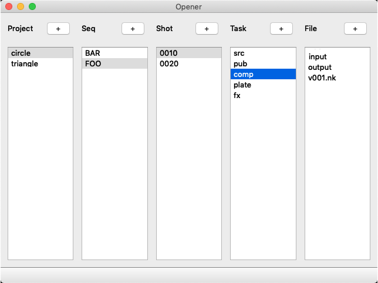

# 파일관리툴 제작

작업파일을 열고 관리하기 위해서 많은 회사는 파일 매니징툴을 제작하여 사용합니다.

프로젝트를 진행하며 파일에 접근하기 편하게 도와주는 툴입니다.
대체적으로 기능은 아래와 비슷합니다.

- 클릭하면 하위 폴더, 파일이 단계별로 리스로를 불러와서 출력합니다.
- 파일을 더블클릭하면 관련 어플리케이션으로 파일이 열립니다.

위 코드는 우리가 [경로 베이스 파이프라인](path_based_pipeline.md)이라는 주제로 제작한 경로에서 작동되는 프로그램으로 실습해보겠습니다.

## 실습
- GUI 제작
- 기본 파이썬 코드 작성
- 이벤트 추가
- 메소드 추가
- 디버그
- 코드 정리
- 기능 추가

## 응용
보통 이러한 소프웨어가 만들어지면 연계되는 기능을 만들기 쉽습니다.
데이터를 이곳 저곳에서 가지고 올 수 있는 바탕이 만들어지기도 했고,
파일을 열 때 이 프로그램에서 연다는 큰 규칙이 완성되었기 때문이예요.

그래서 아래 개발 패턴을 생각해 볼 수 있습니다.

- 사용자 자동인식
- 소프트웨어를 띄우기전 PROJECT, SEQ, SHOT, TASK 환경변수를 미리 설정
- 이전에 열었던 파일리스트 연결
- 버그 신고 페이지 연결
- 간단한 사용법 사이트 연결
- 자주 사용하는 프로그램 설정기능
- 그림이 있다면 그림을 프리뷰하는 기능
- DB를 사용하여 프로젝트 데이터를 관리한다면, DB의 값을 불러와서 뿌리는 기능
- 렌더팜 시스템을 사용한다면 렌더팜에 데이터 보내기
- mov 자동생성
- 사용자 로그를 쌓고 분석하기
- 작업파일 백업 시스템 제작
- 등등

## Reference
- https://learn.foundry.com/nuke/developers/111/pythondevguide/asset.html