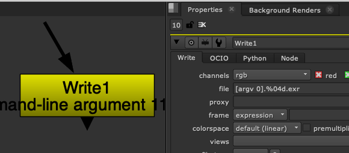
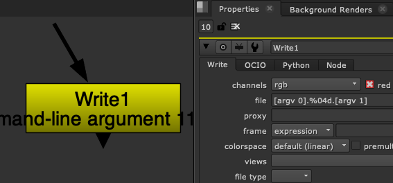

# 뉴크 Cmd
뉴크를 터미널에서 Commandline 으로 조작하는 방법을 알아보겠습니다.

## 뉴크 실행
터미널을 이용해서 뉴크를 실행하는 방법을 알아보겠습니다.

```bash
$ cd Nuke11.2v5
$ ./Nuke11.2
```

NukeX 실행
```bash
$ cd Nuke11.2v5
$ ./Nuke11.2 --nukex
```

Nuke Studio 실행
```bash
$ cd Nuke11.2v5
$ ./Nuke11.2 --studio
```

Nuke Assist 모드로 실행 : 로토, 트레킹같은 단순한 작업을 할 수 있는 뉴크가 실행됩니다. NukeX 1카피를 사면 2개의 Assist 모드를 지원합니다.
```bash
$ ./Nuke11.2 --nukeassist
```

Nuke를 비상업용(Non Commercial Mode)으로 실행합니다.
```bash
$ ./Nuke11.2 --nc
```

> 중요점! VFX 소프트웨어는 cmd 모드에서 실행가능합니다. 자신이 배우고 싶어하는 툴에는 어떤 옵션이 존재하는지 메뉴얼을 통해서 학습하면 툴의 이해도가 높아집니다.

## 뉴크 렌더링
자주 사용하는 렌더링 패턴을 설명합니다.

> 참고 : 일반적으로 스튜디오에서 작업하는 구간은 1프레임이 아닙니다.
불, 물, 옷, 헤어 시뮬레이션처럼 미리 앞쪽부터 연산되어야 하는 작업이 있을 때 음수 프레임이 만들어지기 때문입니다. 회사마다 다르지만, 2D작업이 많은 회사는 101에서 시작하기도 하고 FX, 군중, 헤어,퍼, 천시뮬레이션 처럼 앞쪽 시뮬레이션이 긴경우 1001에서 시작하기도 합니다.

myscript.nk 파일을 1001 프레임부터 1100 프레임까지 렌더링하기.

```bash
$ nuke -F 1001-1100 -x myscript.nk
$ nuke -x myscript.nk 1001,1100
```

myscript.nk 뉴크 파일 내부노드중 Write1 노드만 1001~1100 프레임 렌더링하기

```bash
$ nuke -F 1001-1100 -X Write1 myscript.nk
```

우리는 뉴크를 터미널로 렌더링하는 방법을 다루었지만 실제로 렌더링이라는 과정이 있는 모든 소프트웨어는 
마야, 후디니, 렌더맨, Vray, 아놀드 등등 모두 Commandline 렌더링을 지원합니다. 대부분 위 형태처럼 명령어와 인수로 구성되어있습니다.

#### 뉴크 Cmd렌더링에 사용되는 기타옵션
- `-i` : 인터렉티브 라이센스를 사용합니다. 조직이 플루팅 라이센스 서버를 사용한다면 이 옵션을 붙혀서 렌더링 걸어주세요. 우리 강의실은 현재 플루팅 서버를 운용중입니다.

- `-m` : 사용할 쓰레드 갯수

- `-f` : full 레졸루션으로 뉴크파일을 실행합니다.
- `-p` : 프록시 레졸루션으로 뉴크파일을 실행합니다. 요즘 넷플릭스 처럼 4K를 작업하는 상황에서는 작업 중간중간 프록시를 많이 사용합니다.

- `--sro` : 렌더 Order 순서대로 렌더링 합니다.
- `-remap` : 경로를 바꾸어서 렌더링할 때 사용합니다. 항상 `,`구분문자를 기준으로 짝수가 되어야 합니다. 회사 내부에 윈도우즈, 리눅스가 혼용되어 사용하면 이 옵션은 렌더링시 굉장히 편리할 수 있습니다.
    ```
    $ nuke -t -remap "//10.20.30.40/project,/project,//10.20.30.40/source,/source"
    ```


- `-b` : 백그라운드 모드로 뉴크를 실행합니다. 터미널만 실행되고 있는 상태입니다.

- `-c` : 캐쉬 메모리를 제한할때 사용합니다. 800K 또는 2000M 또는 10G형태로 적습니다.

- `-h` : 도움말을 띄웁니다.

- `-l` : read,write노드의 컬러스페이스를 default가 아닌 linear로 설정합니다.

- `-n` : Read노드의 postage stamps 기능을 끈 상태로 스크립트를 엽니다.(노드가 굉장히 무거울때 오픈속도가 빠릅니다.)

- `-q` : 렌더링 진행시 아무 메시지도 나오지 않습니다. 기술적으로 설명한다면 stdin, out, err 출력이 없습니다.

- `-s #` : 각 스레드의 최소 메모리 스텍사이즈입니다. 기본 16MB 설정이며, 최소 1MB까지 설정가능합니다.

- `-t` : 인터페이스가 없는 파이썬 모드로 실행합니다.

- `-V` : 진행되는 전 과정의 프로세스가 출력됩니다. 디테일한 로그를 볼 때 사용합니다.

- `-v` : 이미지를 볼 때 사용하는 옵션입니다.
    ```
    $ nuke -v ./test.exr //이미지를 볼 때.
    $ nuke -v ./test.tif ./test01.exr ./test02.exr //따로 따로 이미지를 볼때
    $ nuke -v ./taxi.%04d.exr 1,50 //시퀀스를 볼 때
    ```

- `-version` : 뉴크 버젼이 출력됩니다.

## 사용자 인수를 받아서 렌더링하는 방법





위 이미지처럼 Write 노드에 사용자 인수를 받도록 익스프레션을 추가할 수 있습니다.

```bash
$ nuke -F 1001-1100 -x renderfile.nk myname
$ nuke -F 1001-1100 -x renderfile.nk myname exr
```

## Python Script를 이용해서 렌더링 1(pseudocode)

convert.py
```python
r = nuke.nodes.Read(file="image.%04d.exr")
w = nuke.nodes.Write(file="image.%04d.jpg")
nuke.execute("Write1",1001,1100)
quit()
```

```
$ nuke -t < convert.py
```

## Python Script를 이용해서 렌더링 2(pseudocode)
imageconvertwithargs.py
```python
import sys
r = nuke.nodes.Read(file = sys.argv[1])
w = nuke.nodes.Write(file = sys.argv[2])
w.setInput(0, r)
nuke.execute("Write1", 1, 5)
```
 
```bash
$ cat imageconvertwithargs.py
$ nuke -t imageconvertwithargs.py myimage.####.tif myimage.####.jpg
```

#### Reference
- https://learn.foundry.com/nuke/8.0/content/user_guide/configuring_nuke/command_line_operations.html

## 실습
1. 스크립트를 작성하기 전에 먼저 렌더링을 위한 뉴크파일을 다양하게 생성합니다.
1. 한 폴더에 모여있는 뉴크파일을 렌더링 하는 스크립트를 Python으로 작성해보세요.
