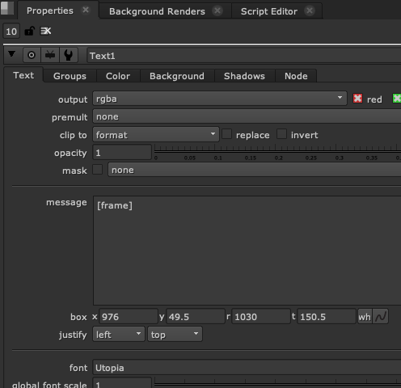

# Nuke Expression for Text Node
텍스트 노드에서도 뉴크 익스프레션을 사용할 수 있습니다.
Text노드에서 자주 사용되는 익스프레션을 실습해 보겠습니다.



프레임 표기
```
[frame]
```

프레임 포멧팅
```
[format %04d [frame]]
```

현재 뉴크파일 씬파일 이름 표기
```
[value root.name]
```

## Metadata
회사, 조직 파이프라인 내에서는 .exr 이미지에 필요한 메타데이터를 담아 다음 팀에 많이 전달합니다.
데이터에 정보를 자유롭게 담을 수 있어서 편리한 방법이기도 합니다.
이 메타데이터 정보를 출력해야하거나 값을 이용해야할 때 유용한 익스프레션입니다.

메타데이터라고 타이핑하면 모든 metadata를 출력합니다.
```
[metadata]
```

메타데이터중 key값을 입력하면 해당 value값이 출력됩니다.
```
[metadata arri/camera/CameraClipName]
```

## 환경변수
환경변수를 가지고 오는 방법은 콘텐츠 제작 파이프라인에서 자주 사용되는 방법입니다.
아래처럼 환경변수를 불러올 수 있습니다.

USER 환경변수를 가지고 오는 예
```
[python os.getenv('USER')]
```

## 시간 가지고오기
시간 정보를 가지고 오는 방법은 뉴크 메뉴얼보다는 Tcl 문서를 보는것이 더 편리합니다.

```
[date %Y]-[date %m]-[date %d] [date %T]
```

- Tcl 시간포멧팅 문서 : https://www.tcl.tk/man/tcl8.5/tutorial/Tcl41.html

## 100에 -1 씩 카운트 되는 익스프레션
```tcl
[expression 100-int(frame/24)]
```

## Reference
- https://learn.foundry.com/nuke/8.0/content/user_guide/effects/entering_text.html
