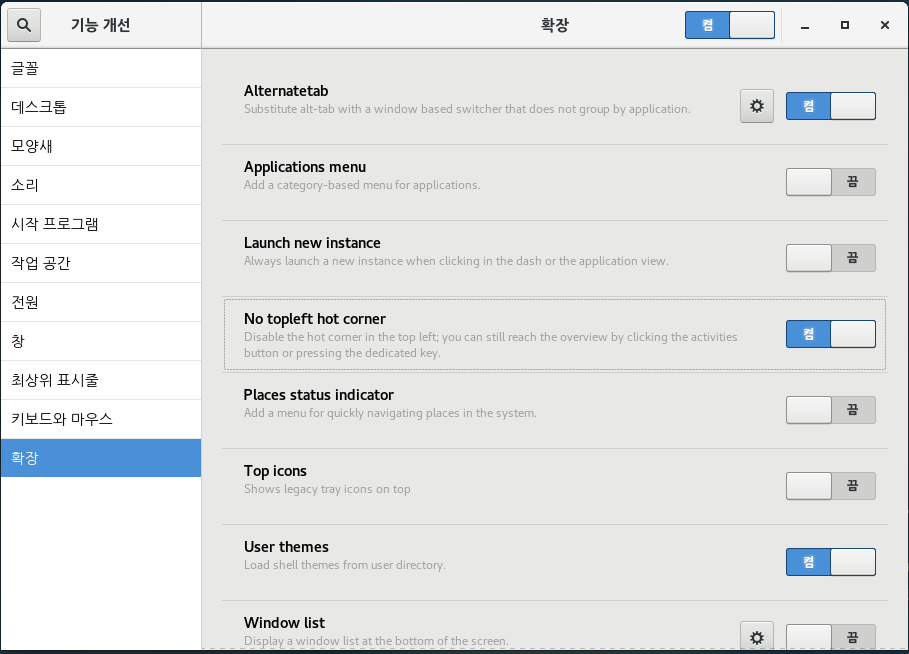

# 핫코너 비활성화
그래픽툴을 사용할 때 Hot Corner 기능이 계속 켜져서 불편할 때가 있습니다.
앞으로 뉴크를 많이 다루게 되니 Hot Corner 기능을 비활성화 해보겠습니다.

```
# yum -y install gnome-tweak-tool
# yum -y install gnome-shell-extension-no-hot-corner
# reboot
```

```
$ gnome-tweaks
```



## 실습
- 핫코너 비활성화를 위한 패키지 설치 .sh 스크립트를 github에 작성하고 git push 하기
