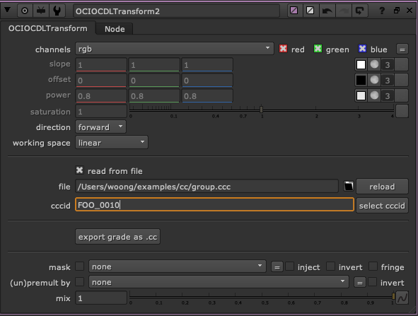
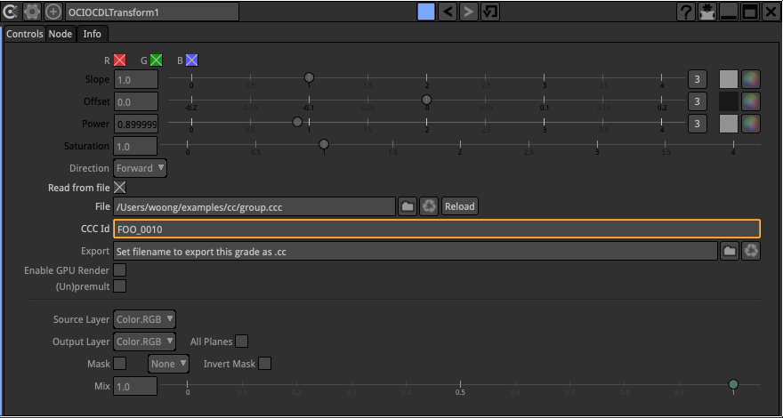

# OpenColorIO LUT
OpenColorIO에서는 컬러컬렉션을 위해서 .cc, .ccc 파일을 사용합니다.
참고로 Sony Pictures Image 에서는 1D lut는 .spi1d, 3D lut는 .spi3d 포멧이 사용됩니다. 사실상 같은 포멧입니다.
OpenColorIO의 LUT는 xml 포멧으로 작성되어 있습니다.

사용하는 목적
- OpenColorIO 환경에서 Lut 파일로 사용합니다.
- 색보정하기 위해서 사용합니다.
- 원본 컬러를 유지하며 후반작업에서 개별 샷을 색보정하며 보거나 작업에 색보정 적용, 색보정 해제하기 위해서 사용합니다.

## .cc
일반적으로 VFX회사에서는 각각 하나하나의 샷을 그레이딩할 때 많이 사용하는 포멧입니다.
회사는 이러한 방식으로 각 샷의 컬러를 돌릴 때 파이프라인상에서 잘 동작되도록 파이프라인을 구현합니다. 이러한 파이프라인을 Natural grade pipeline 이라고 합니다.
회사마다 프로세스는 조금씩 다르지만, 보통 아래 방식중에서 자사에 맞는 방식을 채택하고 활용합니다.

- ocio.config설정파일방법
- 개별 .cc 파일로 정보 공유
- .ccc 파일로 그룹정보 공유
- DB 저장
- .exr 파일 Attr 값 활용

파일내부 구성은 아래와 같습니다.
```
<ColorCorrection id="mygrade">
        <SOPNode>
             <Slope>2 1 1</Slope>
             <Offset>0 0 0</Offset>
             <Power>1 1 1</Power>
        </SOPNode>
        <SATNode>
             <Saturation>1</Saturation>
        </SATNode>
</ColorCorrection>
```

- 참고 : http://opencolorio.org/userguide/contexts.html Per-shot grades 참고.

## .ccc
.cc파일의 그룹이라고 생각하면 됩니다. id를 이용해서 각 정보를 불러올 수 있습니다.

```
<ColorCorrectionCollection xmlns="urn:ASC:CDL:v1.2">
<ColorCorrection id="FOO_0010">
        <SOPNode>
             <Slope>2 1 1</Slope>
             <Offset>0 0 0</Offset>
             <Power>1 1 1</Power>
        </SOPNode>
        <SATNode>
             <Saturation>1</Saturation>
        </SATNode>
</ColorCorrection>

<ColorCorrection id="BAR_0010">
        <SOPNode>
             <Slope>2 1 1</Slope>
             <Offset>0 0.1 0</Offset>
             <Power>1 1 1</Power>
        </SOPNode>
        <SATNode>
             <Saturation>1</Saturation>
        </SATNode>
</ColorCorrection>
</ColorCorrectionCollection>
```

뉴크에서 OCIOCDLTransform을 이용해서 파일을 로딩할 수 있습니다.


나트론 OCIOCDLTransform에서도 파일을 로딩할 수 있습니다.


## 실습
뉴크를 이용해서 .cc 파일을 만들어봅시다.

## Reference
http://opencolorio.org/userguide/contexts.html