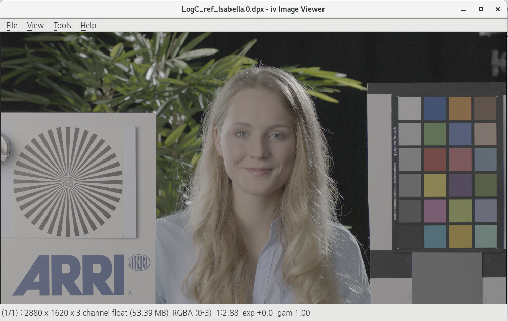

# OpenImageIO

OpenImageIO는 VFX, 게임, 애니메이션 작업등 제작 파이프라인에서 사용할 수 있는 이미지 컨버팅 도구, API 입니다.
ACES(OpenColorIO)를 지원합니다.

이미지를 컨버팅할 때 사용합니다.
오픈소스로 파이프라인을 구축할 때 굉장히 파워풀한 도구가 됩니다.

### 지원하는 포멧

TIFF, JPEG/JFIF, OpenEXR, PNG, HDR/RGBE, ICO, BMP, Targa, JPEG-2000,
RMan Zfile, FITS, DDS, Softimage PIC, PNM, DPX, Cineon, IFF, Field3D,
OpenVDB, Ptex, Photoshop PSD, Wavefront RLA, SGI, WebP, GIF, DICOM,
많은 디지털카메라의 Raw포멧 등

## 설치

낮은 버전은 패키지 관리툴을 이용해서 아래처럼 손쉽게 설치할 수 있습니다.
높은 버전을 사용하기 위해서는 직접 컴파일이 필요합니다.

CentOS7.9

```bash
sudo yum install OpenImageIO -y
sudo yum install OpenImageIO-iv -y
sudo yum install OpenImageIO-devel -y
sudo yum install OpenImageIO-utils -y
sudo yum install python-OpenImageIO -y
```

RockyLinux8.9

```bash
sudo dnf -y install OpenImageIO
sudo dnf -y install OpenImageIO-utils
sudo dnf -y install python3-openimageio
sudo dnf -y install OpenImageIO-iv
sudo dnf -y install OpenImageIO-devel
```

Ubuntu

```bash
sudo apt-get update -y
sudo apt-get install -y openimageio-tools
```

macOS

```bash
$ brew install openimageio
```

- Windows
	- https://github.com/OpenImageIO/oiio/blob/master/INSTALL.md
	- https://sites.google.com/site/openimageio/building-oiio-on-windows

## 명령어

OpenImageIO, OpenImageIO Util 명령어를 알아보겠습니다.

### iinfo

이미지의 정보를 분석하는 툴입니다.

```bash
$ iinfo test.exr 
test.exr : 2880 x 1620, 3 channel, half openexr
```

### iconvert

이미지를 컨버팅할 때 사용합니다.
일반적으로 exr파일에 메타데이터를 추가할 때 더 많이 사용하는 명령어 입니다.

```bash
$ iconvert --inplace --caption testimage test.exr
```

이미지에 키워드 추가하기

```bash
$ iconvert --inplace --keyword woong test.exr
```

exr이미지에 어트리뷰트 추가하기

```bash
$ iconvert --inplace --attrib project circle --attrib shot FOO_0010 test.exr
```

### idiff

이미지를 비교하는 명령어

PASS 문자가 출력되면 같은 이미지 입니다.

```bash
$ idiff image1.exr image2.exr 
Comparing "image1.exr" and "image2.exr"
PASS
```

결과가 다르면 분석값을 출력하고 FAILURE을 최종 출력합니다.

```bash
$ idiff image1.exr image2.exr
Comparing "image1.exr" and "image2.exr"
  Mean error = 0.327311
  RMS error = 0.508405
  Peak SNR = 28.74
  Max error  = 13.0548 @ (843, 275, B)
  4665600 pixels (100%) over 1e-06
  4665600 pixels (100%) over 1e-06
FAILURE
```

### igrep

이미지 메타데이터를 검색할 때 사용합니다.

만약 이미지 내부에 `A004R23J` 문자가 존재하는지 검사할 때

```bash
$ igrep A004R23J test.exr
```

### iv

이미지 뷰어입니다.



```bash
$ iv input.ext
```

### maketx

[minmap](https://ko.wikipedia.org/wiki/밉맵) tx 파일이 생성됩니다.(작은이미지를 미리 만들어 놓는 과정. -> 렌더링 속도 향상을 목적으로 합니다.)
이미지를 MipMap 타일 이미지로 변환하는 명령어 입니다. Pixar Renderman의 txmake와 비슷한 명령어입니다.
minmap과 비슷한 개념은 모델링 데이터에서 LOD(Level of Detail) 개념과 비슷합니다.(텍스쳐 LOD죠!)

소니이미지웍스의 Larry Gritz에 의해서 개발되었습니다.

> 참고 : 픽사의 렌더맨을 설치하면 내부에 있는 txmake 명령어와 혼동하기 쉽습니다.

```bash
$ maketx input.jpg
input.tx 파일이 생성됩니다.
```

oiio 타일사이즈 기준으로 변경.

```bash
$ maketx -v -u --oiio --checknan --filter lanczos3 path/to/fileIn.tif -o path/to/fileOut.tx
```

렌더맨 타일사이즈 기준으로 변경.

```bash
$ maketx -v -u --prman --checknan --filter lanczos3 path/to/fileIn.tif -o path/to/fileOut.tx
```

#### Reference

- https://docs.arnoldrenderer.com/display/A5AFMUG/Tx+Manager
- https://docs.arnoldrenderer.com/display/A5AFMUG/Maketx
- https://answers.unity.com/questions/310352/texture-mipmap-distance.html

### oiiotool

OpenImageIO를 설치하면 사용할 수 있는 이미지 프로세싱 툴입니다.
가장 많이 사용하게 될 명령어 입니다.

## 컬러 프로파일 로딩 체크

[OpenColorIO-Configs 설치방법](opencolorio.md)

```bash
$ export OCIO=$HOME/app/OpenColorIO-Configs/aces_1.2/config.ocio
```

OCIO를 인식하는지 체크해보겠습니다.

```bash
$ oiiotool --help
```

OpenImageIO 2.1.0 버전처럼 높은 버전에서는 Colorspace 리스트를 보기위해 아래 명령어처럼 입력이 필요합니다.

```bash
$ oiiotool --colorconfig
```

아래처럼 컬러스페이스 리스트가 나오면 정상입니다.

```bash
Known color spaces:

"ACES - ACES2065-1",
"ACES - ACEScc",
"ACES - ACEScct",
"ACES - ACESproxy",
"ACES - ACEScg" (linear),
....
"role_matte_paint",
"role_color_picking",
"role_color_timing"

Known displays:
	"ACES"* (views:
			"sRGB"*,
			"DCDM",
			"DCDM P3 gamut clip",
			"P3-D60",
			"P3-D60 ST2084 1000 nits",
			"P3-D60 ST2084 2000 nits",
			"P3-D60 ST2084 4000 nits",
			"P3-DCI",
			"Rec.2020",
			"Rec.2020 ST2084 1000 nits",
			"Rec.709",
			"Rec.709 D60 sim.",
			"sRGB D60 sim.",
			"Raw",
			"Log"
		) (* = default)
```

oiiotool을 사용할 준비가 끝났습니다.

## ACES exr to rec709

oiiotool을 가장 많이 사용할 때는 ACES exr 파일을 아티스트가 보기 편한 rec709 컬러스페이스 프리뷰 이미지로 변환하는 일입니다. 변환해 보겠습니다.

테스팅 할 것

```bash
$ oiiotool input.exr --colorconvert "ACES - ACEScg" "Output - Rec.709" -o ouput.jpg
```

프리뷰 이미지를 만들 때 --fit 옵션을 사용하면 리사이즈 할 수 있습니다.

```bash
$ oiiotool input.exr --colorconvert "ACES - ACEScg" "Output - Rec.709" --fit 320x240 -o ouput.jpg
```

## Dpx to sRGB

참고 : ADX10은 ACES DPX 10bit 의 약자입니다.

```bash
$ oiiotool input.dpx --colorconvert "Input - ADX - ADX10" "Output - sRGB" -o ouput.jpg
```

만약 dpx가 Arri V3 LogC 커브로 인코딩 되어있다면 아래같은 옵션을 사용할 수 있습니다.

```bash
$ oiiotool input.dpx --colorconvert "Input - ARRI - Curve - V3 LogC (EI800)" "Output - sRGB" -o ouput.jpg
```

## .exr to .tga

일반적으로 .exr 이미지는 linear 컬러스페이스를 가지며, tga 파일은 sRGB 컬러스페이스를 가집니다.
oiiotool 명령어는 기본적으로 이미지 알파 채널에 대해서 premult를 하지 않으니 알파가 있는 exr 이미지 컨버팅시에는 꼭 `--premult` 옵션을 달아주세요.

```bash
$ oiiotool input.exr --colorconvert linear srgb --premult -o output.tga
```

## 이미지 리사이즈 

이미지를 리사이즈 할 때는 `--resize` 옵션을 사용할 수 있습니다.

```bash
$ oiiotool input.exr --resize 2048x1152 -o output.exr
```

## Timecode 확인

exr 내부에 들어있는 타임코드를 확인할 수 있습니다.

```bash
$ oiiotool --info -v input.exr
Reading input.exr
input.exr : 4096 x 2160, 3 channel, half openexr
channel list: R, G, B
oiio:ColorSpace: "Linear"
compression: "none"
PixelAspectRatio: 1
screenWindowCenter: 0 0
screenWindowWidth: 1
smpte:TimeCode: 01:18:19:06
```

## CentOS7.9 컴파일전 필요한 라이브러리

위에서 필요한 명령어는 간단하게 설치가 끝났습니다.
명령어를 위해서 컴파일 할 필요는 없지만, 다른 프로그램을 컴파일할 때 활용됩니다.

```bash
yum install -y clang #LLVM 시스템과 함께 작동하는 C,C++,Objective-C,Objective-C++ 컴파일러 입니다.
yum install -y webp-devel
yum install -y opencv-devel
```

### Cmake 컴파일

- [Cmake 컴파일](cmake.md): AWS t2.micro 기준 약 30분 소요


## RockyLinux8.8 컴파일전 필요한 라이브러리

```bash
dnf install gcc-toolset-11
scl enable gcc-toolset-11 bash

dnf install -y clang #LLVM 시스템과 함께 작동하는 C,C++,Objective-C,Objective-C++ 컴파일러 입니다.
dnf install -y libwebp-devel
dnf install -y opencv-devel
dnf install -y autoconf
dnf install -y automake
dnf install -y libtool
```

## AWS EC2에서 컴파일시 필요한 사항

- AWS에서 OpenImageIO를 컴파일 하려면 최소 t2.small 이상의 머신이 필요합니다.
- 메모리 2기가 이상이 필요합니다.

```bash
sudo amazon-linux-extras install epel -y
sudo yum install git -y
sudo yum-config-manager --add-repo http://mirror.centos.org/centos/7/sclo/x86_64/rh/
wget http://mirror.centos.org/centos/7/os/x86_64/Packages/libgfortran5-8.3.1-2.1.1.el7.x86_64.rpm
sudo yum install -y libgfortran5-8.3.1-2.1.1.el7.x86_64.rpm -y # devtoolset-9가 설치되려면 libgfortran이 필요합니다.
sudo yum install -y devtoolset-9 --nogpgcheck
sudo yum install autoconf -y
sudo yum install automake -y
sudo yum install libtool -y
```


## Boost 컴파일

- [boost 컴파일](boost.md): AWS t2.micro 기준 약 1시간 소요


## OpenImageIO 컴파일

아래 명령어를 순서대로 실행하면 컴파일이 됩니다.
oiiotool과 함께 연동이 필요한 라이브러리는 필요시 추가하여 빌드합니다.

```bash
scl enable gcc-toolset-11 bash # VFX Reference Platform 2024
dnf -y remove cmake # 만약 기존에 cmake 가 존재하면 지운다.
dnf -y install automake # libraw를 설치하기 위해 aclocal 명령어가 필요하다.
dnf -y install libtool # libraw를 설치하기 위해 필요하다.
export PATH=$PATH:$HOME/app/cmake-3.20.5/bin #cmake가 필요합니다. PATH에 잡아줍니다.
cd $HOME/app
git clone https://github.com/OpenImageIO/oiio OpenImageIO_src
cd $HOME/app/OpenImageIO_src
git checkout v2.5.8.0
cd ..
mkdir OpenImageIO
cd $HOME/app/OpenImageIO_src
vim src/build-scripts/build_opencolorio.bash # OpenColorIO 2.3.2 변경.
sh src/build-scripts/build_opencolorio.bash # OpenColorIO
sh src/build-scripts/build_pybind11.bash # Python
sh src/build-scripts/build_openexr.bash # OpenEXR 지원
sh src/build-scripts/build_OpenJPEG.bash # .jpg 지원
sh src/build-scripts/build_libjpeg-turbo.bash # .jpg 지원
sh src/build-scripts/build_libpng.bash # .png 지원
sh src/build-scripts/build_libtiff.bash # .tiff 지원
sh src/build-scripts/build_libraw.bash # raw 지원
```

컴파일 하기(몇번 더 타이핑해보기)

```bash
make VERBOSE=1 STOP_ON_WARNING=0 USE_OCIO=1 INSTALL_PREFIX=$HOME/app/OpenImageIO Boost_ROOT=$HOME/app/boost_1_82_0 OpenColorIO_ROOT=$HOME/app/OpenImageIO_src/ext/dist JPEG_ROOT=${PWD}/src/build-scripts/ext/dist JPEGTurbo_ROOT=${PWD}/src/build-scripts/ext/dist PNG_ROOT=${PWD}/src/build-scripts/ext/dist LIBTIFF_ROOT=${PWD}/src/build-scripts/ext/dist LibRaw_ROOT=${PWD}/src/build-scripts/ext/dist USE_PYTHON=0 INTERFACE_INCLUDE_DIRECTORIES=$HOME/app/OpenImageIO_src/ext/dist/include
```

```bash
make install
```

## 잘 컴파일이 되었는지 체크하기 위해 oiiotool 명령어 실행하기

oiiotool을 실행하기 위해 필요한 .so 파일을 로딩하기 위해 `LD_LIBRARY_PATH`를 설정하고 oiiotool을 실행해봅니다.

```bash
export LD_LIBRARY_PATH=$LD_LIBRARY_PATH:$HOME/app/OpenImageIO/lib64:$HOME/app/OpenImageIO_src/ext/dist/lib:$HOME/app/OpenImageIO_src/ext/dist/lib64
mkdir -p $HOME/lib/OpenColorIO-Configs/aces_1.3
cd $HOME/lib/OpenColorIO-Configs/aces_1.3
wget https://github.com/AcademySoftwareFoundation/OpenColorIO-Config-ACES/releases/download/v2.0.0/cg-config-v2.1.0_aces-v1.3_ocio-v2.3.ocio
wget https://github.com/AcademySoftwareFoundation/OpenColorIO-Config-ACES/releases/download/v2.0.0/studio-config-v2.1.0_aces-v1.3_ocio-v2.3.ocio
export OCIO=$HOME/lib/OpenColorIO-Configs/aces_1.3/cg-config-v2.1.0_aces-v1.3_ocio-v2.3.ocio
$HOME/app/OpenImageIO/bin/oiiotool
```

## Test

컨버팅이 잘 되는지 테스팅 합니다.

```bash
cd ~
mkdir $HOME/tmp
cd $HOME/tmp
wget https://github.com/lazypic/tdcourse_examples/raw/master/ACES_Plate/ACES_ref_Isabella.0.exr
$HOME/app/OpenImageIO/bin/oiiotool --colorconvert "ACES2065-1" "Linear Rec.709 (sRGB)" -i $HOME/tmp/ACES_ref_Isabella.0.exr -o $HOME/tmp/output.exr
```

### AWS DOTORI admin 설정값

```bash
/home/ec2-user/app/OpenImageIO/lib64:/home/ec2-user/app/OpenImageIO_src/ext/dist/lib:/home/ec2-user/app/OpenImageIO_src/ext/dist/lib64
```

### RockyLinux DOTORI admin 설정값

```bash
/root/app/OpenImageIO/lib64:/root/app/OpenImageIO_src/ext/dist/lib:/root/app/OpenImageIO_src/ext/dist/lib64
```


## 실 습

- OpenImageIO를 컴파일 해봅시다.
- Python과 oiiotool을 이용해서 썸네일을 만들어봅시다.
- 각 옵션들을 다르게 설정해서 실행해 봅니다.

## Reference

- https://github.com/OpenImageIO/oiio/blob/master/src/doc/openimageio.pdf
- [webp 란?](https://ko.wikipedia.org/wiki/WebP) : jpeg를 대체하기 위해 구글에서 개발된 포멧입니다. 사파리 브라우저에서 이미지가 보이지 않습니다.
