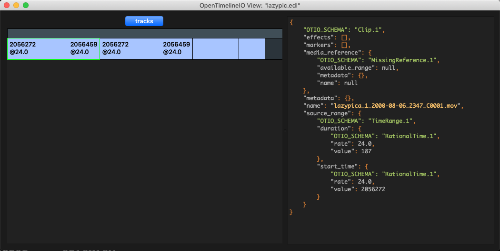

# OTIO
OTIO는 OpenTimelineIO의 약자입니다.
편집 Cut 정보를 다루는 API입니다. EDL파일이 너무 오래 되었기 때문에 EDL파일을 확장하기 위해 만들어진 포멧입니다. 픽사에서 만들어지고 있습니다. 파일포멧은 json 파일입니다.

EDL은 간단하지만 정보가 너무 빈약하고,
AAF 포멧은 너무 많은 정보를 담고 있습니다. 또한 처리가 복잡합니다.
OTIO는 json포멧을 사용하며, 위에 제시한 솔루션의 중간위치에서  역할을 할 파일로 개발되는 API입니다.

결국 OTIO가 좋은점은 사용자 메타데이터를 넣을 수 있는 점입니다.
애니메이션 코코에서는 편집툴에서 EDL파일을 뽑아서 필요한 메타데이터를 넣고 OTIO를 만들어서 RV에서 리뷰했답니다.

## AAF란?
Advanced Authoring Format 의 약자입니다.
포스트프로덕션 환경에서 사용할 수 있는 프로페셔널 포멧입니다.
OTIO 프로젝트가 생겼을 만큼 AAF는 복잡합니다.

- https://en.wikipedia.org/wiki/Advanced_Authoring_Format
- http://aaf.sourceforge.net/docs/aafObjectModel.pdf

## OTIO의 목표
픽사에서의 최종 골은
파이널컷 프로, 아비드, 프리미어에서 OTIO를 뽑아서
샷건, RV, 마야에 그대로 활용하고
다빈치 리졸브, 언리얼, 유니티 엔진에 그대로 데이터를 활용하는 것을 목표로 하고 있습니다.

참고자료 : https://opentimelineio.readthedocs.io/en/latest/_static/OpenTimelineIO_2018_04_26_FMX_Published.key.pdf

참고자료를 보면 애니메이션 "CoCo" 작업에 사용된 자료구조를 같이 볼수 있습니다.

- 문서 : https://opentimelineio.readthedocs.io/en/latest/
- 소스코드 : http://opentimeline.io/


## 설치
pip를 이용해서 설치할 수 있습니다.

```
# pip install PySide2
# pip install opentimelineio
```

## 명령어

#### otiocat
otio파일을 STDOUT으로 출력합니다.

```bash
$ otiocat input.edl
```
```
{
    "OTIO_SCHEMA": "Timeline.1", 
    "metadata": {}, 
    "name": "Timeline 1", 
    "tracks": {
        "OTIO_SCHEMA": "Stack.1", 
        "children": [
            {
                "OTIO_SCHEMA": "Track.1", 
                "children": [
                    {
                        "OTIO_SCHEMA": "Clip.1", 
                        "effects": [], 
                        "markers": [], 
                        "media_reference": {
                            "OTIO_SCHEMA": "MissingReference.1", 
                            "available_range": null, 
                            "metadata": {}, 
                            "name": null
                        }, 
                        "metadata": {}, 
                        "name": "lazypica_1_2000-08-06_2347_C0001.mov", 
                        "source_range": {
                            "OTIO_SCHEMA": "TimeRange.1", 
                            "duration": {
                                "OTIO_SCHEMA": "RationalTime.1", 
                                "rate": 24.0, 
                                "value": 187
                            }, 
                            "start_time": {
                                "OTIO_SCHEMA": "RationalTime.1", 
                                "rate": 24.0, 
                                "value": 2056272
                            }
                        }
                    }, 
                    {
                        "OTIO_SCHEMA": "Clip.1", 
                        "effects": [], 
                        "markers": [], 
                        "media_reference": {
                            "OTIO_SCHEMA": "MissingReference.1", 
                            "available_range": null, 
                            "metadata": {}, 
                            "name": null
                        }, 
                        "metadata": {}, 
                        "name": "plate_v001.mov", 
                        "source_range": {
                            "OTIO_SCHEMA": "TimeRange.1", 
                            "duration": {
                                "OTIO_SCHEMA": "RationalTime.1", 
                                "rate": 24.0, 
                                "value": 187
                            }, 
                            "start_time": {
                                "OTIO_SCHEMA": "RationalTime.1", 
                                "rate": 24.0, 
                                "value": 2056272
                            }
                        }
                    }, 
                    {
                        "OTIO_SCHEMA": "Clip.1", 
                        "effects": [], 
                        "markers": [], 
                        "media_reference": {
                            "OTIO_SCHEMA": "MissingReference.1", 
                            "available_range": null, 
                            "metadata": {}, 
                            "name": null
                        }, 
                        "metadata": {}, 
                        "name": "lazypica_1_2000-01-01_0906_C0003.mov", 
                        "source_range": {
                            "OTIO_SCHEMA": "TimeRange.1", 
                            "duration": {
                                "OTIO_SCHEMA": "RationalTime.1", 
                                "rate": 24.0, 
                                "value": 93
                            }, 
                            "start_time": {
                                "OTIO_SCHEMA": "RationalTime.1", 
                                "rate": 24.0, 
                                "value": 786312
                            }
                        }
                    }, 
                    {
                        "OTIO_SCHEMA": "Clip.1", 
                        "effects": [], 
                        "markers": [], 
                        "media_reference": {
                            "OTIO_SCHEMA": "MissingReference.1", 
                            "available_range": null, 
                            "metadata": {}, 
                            "name": null
                        }, 
                        "metadata": {}, 
                        "name": "lazypica_1_2000-01-01_0901_C0002_[000000-000052].dng", 
                        "source_range": {
                            "OTIO_SCHEMA": "TimeRange.1", 
                            "duration": {
                                "OTIO_SCHEMA": "RationalTime.1", 
                                "rate": 24.0, 
                                "value": 53
                            }, 
                            "start_time": {
                                "OTIO_SCHEMA": "RationalTime.1", 
                                "rate": 24.0, 
                                "value": 779088
                            }
                        }
                    }
                ], 
                "effects": [], 
                "kind": "Video", 
                "markers": [], 
                "metadata": {}, 
                "name": "V", 
                "source_range": {
                    "OTIO_SCHEMA": "TimeRange.1", 
                    "duration": {
                        "OTIO_SCHEMA": "RationalTime.1", 
                        "rate": 24.0, 
                        "value": 520
                    }, 
                    "start_time": {
                        "OTIO_SCHEMA": "RationalTime.1", 
                        "rate": 24.0, 
                        "value": -86400
                    }
                }
            }
        ], 
        "effects": [], 
        "markers": [], 
        "metadata": {}, 
        "name": "tracks", 
        "source_range": null
    }
}
```


#### otioconvert
edl 파일등을 otio로 변환할 때 사용합니다.

```
$ otioconvert -i input.edl -o output.otio
```


#### otiostat
otio, edl 파일의 유효성 검사, 통계를 출력합니다.

아래서처럼 파일에 이상이 있는지 체크할 수 있습니다.

```bash
$ otiostat input.edl
$ otiostat input.otio
```

파일에 이상이 있다면 무엇이 이상한지 출력해줍니다.
파일에 존재하면 안되는 수치가 있다면 출력해줍니다.
아래는 에러내용중 하나입니다.

Error:
```
The file did not successfully parse, with error: Source and record duration don't match: RationalTime(260, 24.0) != RationalTime(284, 24.0) for clip Test rename
```

정상적으로 처리가 진행되면 아래처럼 분석된 데이터가 출력됩니다.
```
parsed: True
top level object: Timeline.1
number of tracks: 1
Tracks are the same length: True
deepest nesting: 4
number of clips: 4
total duration: RationalTime(520, 24.0)
total duration in timecode: 00:00:21:16
top level rate: 24.0
clips with cdl data: 0
Tracks with non standard types: 0
```

#### otioview


    사용법
    ```bash
    $ otioview /path/to/your/file.edl
    $ otioview /path/to/your/file.otio
    ```