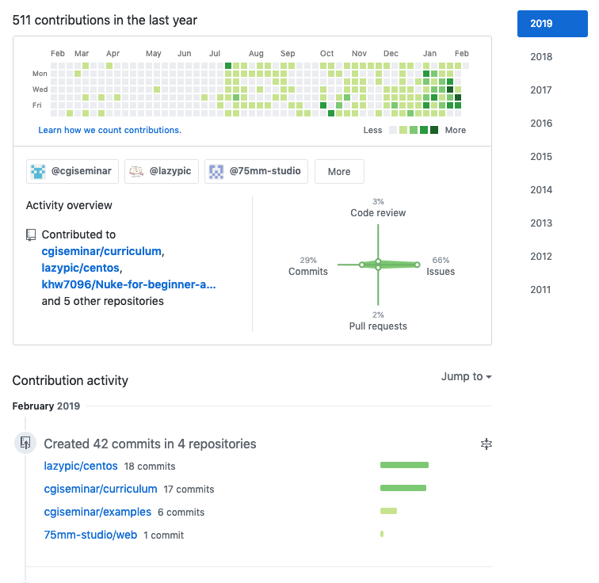
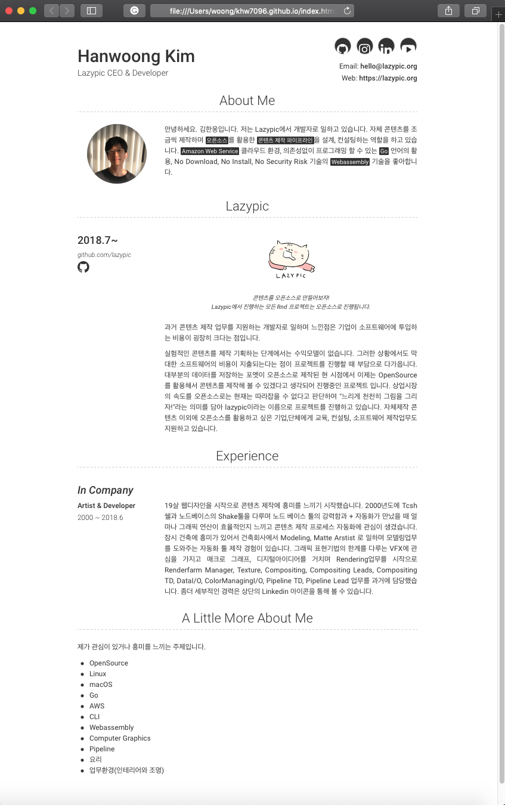

# 개 요
리눅스 VFX Technical Director 양성을 위한 기초 커리큘럼

- 한국 대규모 VFX회사 상황에 맞는 교육
- 운영체제 + 환경변수 + 프로그래밍 + 그래픽툴(Nuke)의 활용 방법을 다루는 내용입니다.
	- 개별 개발 라이브러리의 역사 및 접근방법을 소개합니다.
	- 리눅스(CentOS) + 쉘스크립트 + 파이썬 + 뉴크 파이썬 API 기초를 다룹니다.
	- VFX, 애니메이션, 게임제작에 자주 사용되는 파일포멧을 교육합니다.
- 커리큘럼URL : https://github.com/cgiseminar/curriculum/

## 교육특징
- 강의 초기부터 기업이 이슈를 작성할 수 있도록 교육내용 및 이슈페이지 오픈
- VFX 개발자와 세미나 연계, 회사방문 및 개발자 이슈를 공유합니다.
- Github를 이용해서 교육 초기부터 강사와 학생간 교육 문서 협업합니다.
- Github를 이용해서 학생과 학생간 코드리뷰 및 협업모델을 교육합니다.
- 학생 스스로 이슈를 작성, 관리할 수 있도록 Github 가입, 프로젝트 권한을 부여합니다.
- 학생이 작성한 코드를 온라인상으로 리뷰해줍니다.

## 교육 종료후 기업에게 인재를 추천하는 방법
1. 프로그래밍이 재미있고 분야에 흥미를 가지는 학생을 선별합니다.

1. 기업이 객관적인 평가를 할 수 있도록 교육생 코드저장소를 기업에게 소개합니다. 이곳에서 학생이 작성한 코드, 교육내용, 꾸준함, 개별 데이터를 객관적으로 볼 수 있습니다. 또한 어떤 분야에 관심을 가지는지도 학생이 fork한 리포지터리를 통해서 기업과 학생 상호간 알게됩니다.

1. 교육종료후 교육생 개발자 포트폴리오 사이트 제작후 기업에 URL 전달합니다. 

예시 : [http://khw7096.github.io](http://khw7096.github.io)

1. 기업과 학생모두 미팅 또는 면접에 관심이 있다면, 다음 과정을 진행합니다.
