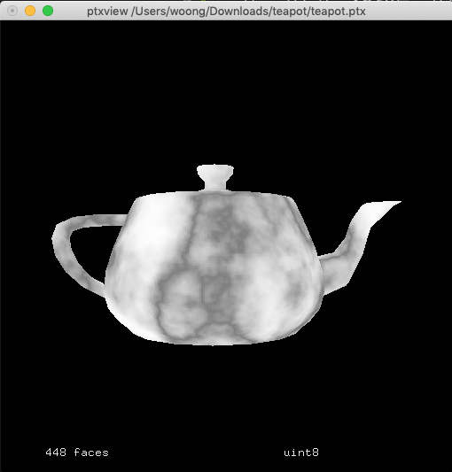
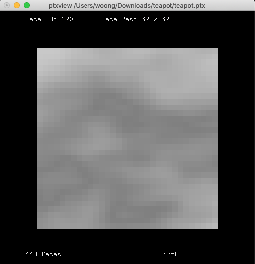

# Ptex
각 면마다 텍스쳐를 설정하여 UV 작업없이 물체에 Texture를 입히는 작업입니다.

- 소스코드 : https://github.com/wdas/ptex

파일 확장자는 .ptx를 사용합니다.

Ptex 프로젝트 자체는 오픈소스입니다.
렌더맨을 설치해도 아래 명령어는 라이센스 없이 사용가능합니다.

## 명령어

### ptfilter
### ptmerge
### ptviewer
### ptxinfo
### ptxmake

### ptxview
ptx 파일을 볼 수 있는 뷰어입니다.



```
$ ptxview input.ptx
```
물체의 형태와 함께 ptx를 볼 수 있습니다.

픽셀을 클릭하면 해당 Face에 사용된 텍스쳐가 보인다.


### ptrender
렌더맨 라이센스가 필요합니다.

## 샘플파일 다운로드
http://ptex.us/samples.html