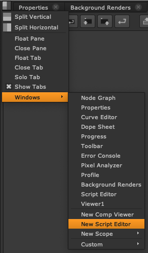

# 뉴크에서 파이썬 띄우기
간단하게 뉴크에서 파이썬을 테스트하고 싶을 때 사용합니다.
Script Editor를 띄워서 Python 코드를 테스트 할 수 있습니다.

이곳에서 프로그램을 할 수 있지만 에디터에서 하는 것보다는 많이 불편합니다.

저는 아래 상황에서 보통 이 Script Editor를 활용합니다.

- Snippet Code 테스트
- 파이썬 라이브러리 버전체크
- 라이브러리가 정상적으로 로딩되는지 체크

시간을 들여서 프로그래밍 해야하는 상황이라면 에디터를 이용해서 프로그래밍 하는것을 추천합니다.



파이썬 코드를 Script Editor 에서 작성할 수 있습니다.

리눅스 : 자주 사용하는 단축키
- `Ctrl + Enter` : 코드 실행
- `Ctrl + [` : 이전 코드 되돌리기

macOS : 자주 사용하는 단축키
- `Cmd + Enter` : 코드 실행
- `Cmd + [` : 이전 코드 되돌리기

## 실습

```bash
print("hello nuke python")
```

위 코드를 타이핑하고 `Ctrl + Enter` 키를 눌러보세요.

Output창에 아래와 같은 결과가 출력되면 정상입니다.
```
# Result: hello nuke python
```