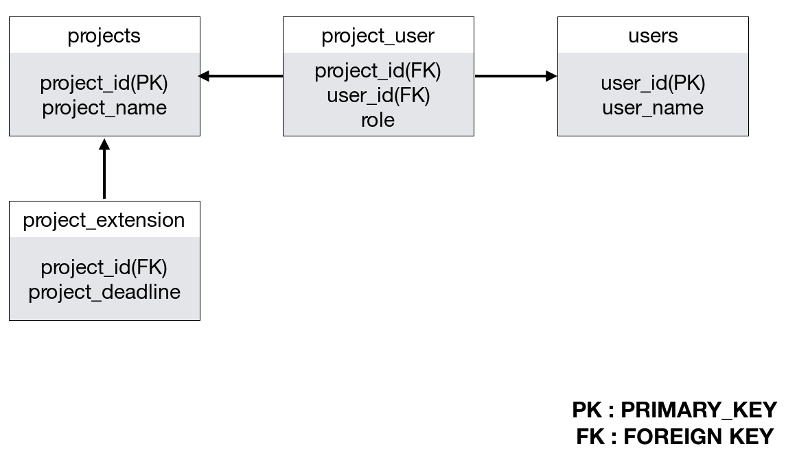

# Python으로 PostrgreSQL 제어하기

## psycopg2 설치

PostgreSQL을 python을 이용해서 DB를 컨트롤할 때 가장 유명한 라이브러리는 psycopg2 입니다.
설치해보겠습니다.

```bash
$ pip install --user psycopg2
$ pip install --user psycopg2-binary
```

홈페이지 : https://pypi.org/project/psycopg2/

## 테이블 생성
데이터를 넣기 위해서는 먼저 데이터를 넣을 테이블이 필요합니다.
테이블을 만드는 예제를 다루어 보겠습니다.




```python
#!/usr/bin/env python
import psycopg2
 
def create_tables():
    commands = (
        """
        CREATE TABLE projects (
            project_id SERIAL PRIMARY KEY,
            project_name VARCHAR(255) NOT NULL
        )
        """,
        """ CREATE TABLE users (
                user_id SERIAL PRIMARY KEY,
                user_name VARCHAR(255) NOT NULL
        )
        """,
        """
        CREATE TABLE project_extension (
                project_id INTEGER PRIMARY KEY,
                project_deadline VARCHAR(25),
                FOREIGN KEY (project_id)
                    REFERENCES projects (project_id)
                    ON UPDATE CASCADE ON DELETE CASCADE
        )
        """,
        """
        CREATE TABLE project_user (
                project_id INTEGER NOT NULL,
                user_id INTEGER NOT NULL,
                role VARCHAR(25),
                PRIMARY KEY (project_id , user_id),
                FOREIGN KEY (project_id)
                    REFERENCES projects (project_id)
                    ON UPDATE CASCADE ON DELETE CASCADE,
                FOREIGN KEY (user_id)
                    REFERENCES users (user_id)
                    ON UPDATE CASCADE ON DELETE CASCADE
        )
        """)
    conn = None
    try:
        # connect to the PostgreSQL server
        conn = psycopg2.connect(host="192.168.219.105",database="projects", user="postgres", password="postgres")
        cur = conn.cursor()
        # create table one by one
        for command in commands:
            cur.execute(command)
        # close communication with the PostgreSQL database server
        cur.close()
        # commit the changes
        conn.commit()
    except (Exception, psycopg2.DatabaseError) as error:
        print(error)
    finally:
        if conn is not None:
            conn.close()

if __name__ == '__main__':
    create_tables()
```

테이블이 잘 생성되어있는지 postgres 쉘로 들어가서 체크를 해봅시다.
dt는 Database Table을 의미합니다.

```bash
# su – postgres
-bash-4.2$ psql -d projects
postgres=# \dt

            List of relations
 Schema |      Name      | Type  |  Owner   
--------+----------------+-------+----------
 public | project_extension | table | postgres
 public | project_user      | table | postgres
 public | projects          | table | postgres
 public | users          | table | postgres
(4 rows)

postgres=# \q
```

## 테이블에 데이터 추가
projects 테이블에 데이터를 추가해 보겠습니다.

```python
#!/usr/bin/env python
import psycopg2
 
def insert_project(project_name):
    sql = """INSERT INTO projects(project_name)
             VALUES(%s) RETURNING project_id;"""
    conn = None
    project_id = None
    try:
        conn = psycopg2.connect(host="192.168.219.105",database="projects", user="postgres", password="postgres")
        # create a new cursor
        cur = conn.cursor()
        # execute the INSERT statement
        cur.execute(sql, (project_name,))
        # get the generated id back
        project_id = cur.fetchone()[0]
        # commit the changes to the database
        conn.commit()
        # close communication with the database
        cur.close()
    except (Exception, psycopg2.DatabaseError) as error:
        print(error)
    finally:
        if conn is not None:
            conn.close()
    return project_id

if __name__ == '__main__':
    insert_project("circle")
```

## 테이블에서 데이터 가지고 오기
```python
#!/usr/bin/env python
import psycopg2

def get_projects():
    conn = None
    try:
        conn = psycopg2.connect(host="192.168.219.105",database="projects", user="postgres", password="postgres")
        cur = conn.cursor()
        cur.execute("""
            SELECT project_id, project_name
            FROM projects
            ORDER BY project_name;
        """)
        print("The number of projects: ", cur.rowcount)
        row = cur.fetchone()
 
        while row is not None:
            print(row)
            row = cur.fetchone()
        cur.close()
    except (Exception, psycopg2.DatabaseError) as error:
        print(error)
    finally:
        if conn is not None:
            conn.close()

if __name__ == '__main__':
    get_projects()
```

## 테이블에서 데이터 업데이트하기
```python
#!/usr/bin/env python
import psycopg2 

def update_project(project_id, project_name):
    sql = """ UPDATE projects
                SET project_name = %s
                WHERE project_id = %s"""
    conn = None
    updated_rows = 0
    try:
        conn = psycopg2.connect(host="192.168.219.105",database="projects", user="postgres", password="postgres")
        # create a new cursor
        cur = conn.cursor()
        # execute the UPDATE  statement
        cur.execute(sql, (project_name, project_id))
        # get the number of updated rows
        updated_rows = cur.rowcount
        # Commit the changes to the database
        conn.commit()
        # Close communication with the PostgreSQL database
        cur.close()
    except (Exception, psycopg2.DatabaseError) as error:
        print(error)
    finally:
        if conn is not None:
            conn.close()
 
    return updated_rows
if __name__ == '__main__':
    update_project("1","circle2")
```

## 테이블에서 데이터 삭제

```python
#!/usr/bin/env python
import psycopg2
 
def delete_project(project_id):
    conn = None
    rows_deleted = 0
    try:
        # read database configuration
        params = config()
        # connect to the PostgreSQL database
        conn = psycopg2.connect(**params)
        # create a new cursor
        cur = conn.cursor()
        # execute the UPDATE  statement
        cur.execute("DELETE FROM projects WHERE project_id = %s", (project_id,))
        # get the number of updated rows
        rows_deleted = cur.rowcount
        # Commit the changes to the database
        conn.commit()
        # Close communication with the PostgreSQL database
        cur.close()
    except (Exception, psycopg2.DatabaseError) as error:
        print(error)
    finally:
        if conn is not None:
            conn.close()
    return rows_deleted

if __name__ == '__main__':
    delete_project("1")
```

## Reference
http://www.postgresqltutorial.com/postgresql-python/connect/
