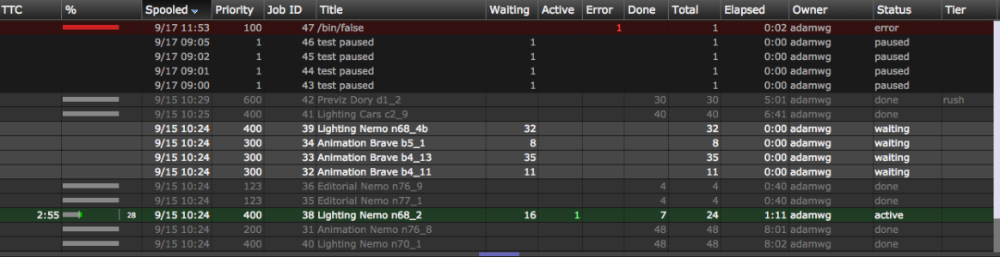
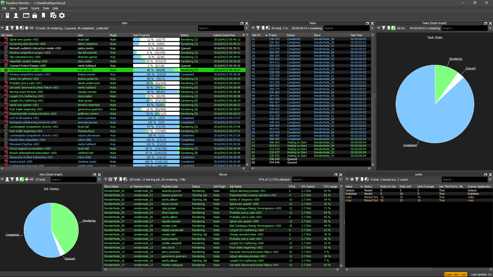

# 렌더링 매니지먼트 툴
지난시간에 Command line을 이용한 파일을 렌더링 하는 방법을 배웠습니다.
회사에서는 이러한 작업을 대규모로 진행하기 위해서 렌더팜과 렌더 매니지먼트 툴을 셋팅하여 사용합니다. 자주 사용하는 렌더 매니지먼트 툴을 알아보겠습니다.

경험상 대부분 회사에서 Tractor, Deadline을 많이 사용하였습니다.

일반적으로 렌더링 매니지먼트 툴은 command를 처리할 수 있기 때문에, 시뮬레이션, 베이크, 파일복사, mov생성등의 작업도 렌더링 매니지먼트 툴을 이용해서 처리합니다.

## OpenCue
소니이미지웍스에서 사용하는 렌더링 매니징툴이 오픈소스로 전환되었습니다.
- 문서 : https://github.com/imageworks/OpenCue/wiki
- 소스코드 : https://github.com/imageworks/OpenCue

## Tractor
웹브라우저에서 바로 사용할 수 있기 때문에 클라이언트(아티스트)가 정보를 확인하기 편리합니다.

- 홈페이지 : https://renderman.pixar.com/tractor
- 셋팅방법 : https://github.com/mgskorea/tractor

## Deadline

- 홈페이지 : https://deadline.thinkboxsoftware.com/

## Flamenco

- 홈페이지 : https://github.com/armadillica/flamenco

## Qube!

- 홈페이지 https://www.pipelinefx.com

## Autodesk Backburner
웹에서 바로 사용가능 합니다.

- 홈페이지 : https://apps.autodesk.com/MAYA/en/Detail/Index?id=3481100546473279788&os=Win64&appLang=en&_ga=2.56810606.597913409.1544113044-1307347418.1543763391

경험상 job이 많이 올라가면 느려집니다.
오토데스크 제품에 무료로 껴주기 때문에 셋팅하여 사용할 수 있습니다.
