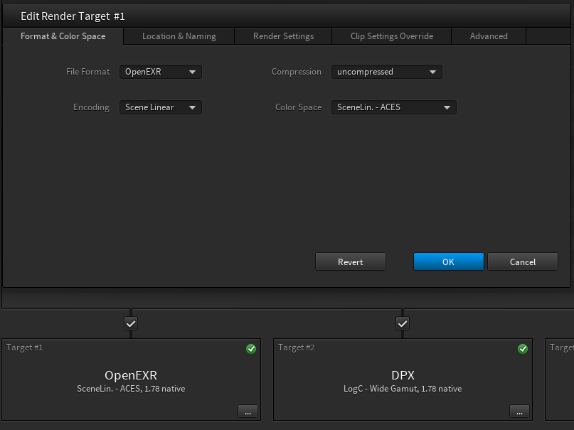

# sample파일

### OIIO 이미지 파일 샘플 다운로드.
OpenImageIO 리포지터리에는 이미지 샘플파일이 존재합니다.
```
$ git clone https://github.com/OpenImageIO/oiio-images.git
```

### DPX
- https://f1.creativecow.net/1318/dpx-sample

### ACES exr(Arri ACES reference Image)
아래 URL을 통해서 Arri Alexa로 찍은 이미지를 어떻게 ACES Exr로 컨버팅 되는지 알 수 있습니다.
각 컨버팅 이미지가 어떻게 보이는지 예제 파일을 다운로드 받을 수 있습니다.

- https://www.arri.com/service/search/en/49664?query=aces

### Black Magic Camera
- 샘플 다운로드 : https://www.blackmagicdesign.com/kr/products/blackmagicpocketcinemacamera/gallery

### Alexa Plate
Alexa Plate 는 http://www.arri.com/camera/alexa/learn/alexa_sample_footage/ 주소를 통해서 다운로드 받을 수 있습니다.

실제 데이터는 ftp를 통해서 다운로드 받을 수 있습니다.

- Server : ftp-footage.arri.de
- User : ALEXA
- Pass : samplefootage

받은 footage는 [Arri Converter](http://www.arri.com/camera/alexa/tools/arriraw_converter/)를 이용해서 컨버팅후 사용합니다.

#### ALEXA LF ProRes Mov파일
- https://arriwebgate.com/en/directlink/e631dcb5b6ac8eb5

### Red Plate

### BLENDER 3D Scene
강의중에는 지원되는 라이센스를 통해서만 교육이 됩니다. 간혹 3D데이터가 필요할 때 활용할 수 있는 Blender 데모파일 입니다.

- https://www.blender.org/download/demo-files/

## Arri Raw Converter

.ari 파일을 컨버팅 하기 위해서는 일반적으로 arriraw_converter를 사용합니다.
소프트웨어는 아래에서 다운로드 받을 수 있습니다.

https://www.arri.com/en/learn-help/learn-help-camera-system/tools/arriraw-converter

ACES로 출력하기 위한 옵션은 아래와 같습니다.


## HDRI
- https://www.hdri-hub.com/free-samples