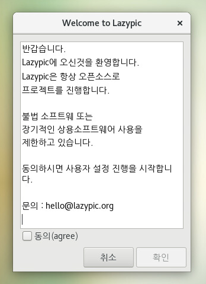
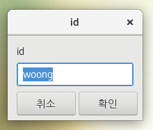
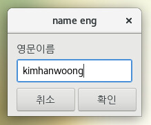
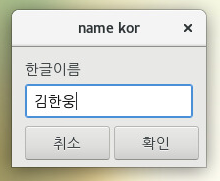
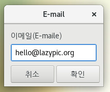
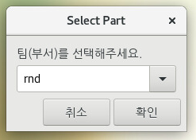
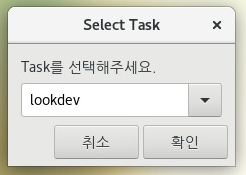
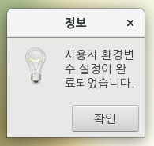
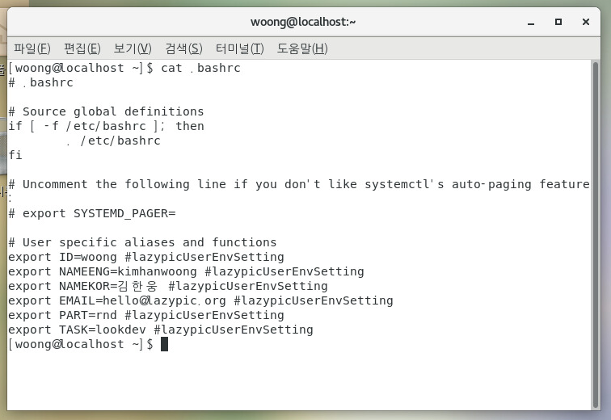

# Setuser
Zenity를 이용해서 사용자 환경변수 등록 프로그램을 제작해보겠습니다.

보통 작업전 최초 한번 실행하는 소프트웨어이기 때문에 많은 시간을 들이는 것이 때론 시간낭비가 될 수 있는 소프트웨어 입니다.

따라서 간단하게 Zenity를 이용하여 제작해 봅시다.

사용자 환경변수를 설정하고 사용하면 셋팅에 들인 시간에 대비해 개인PC뿐 아니라, 공용 PC, LDAP 설정된 컴퓨터도 동일한 환경에서 작업 할 수 있는 간편한 장점이 있습니다.

## 최종화면
아래 프로그램은 Lazypic에서 사용하는 setuser 명령어 입니다.

환경변수를 설정하는 방법은 몇가지 이점이 있습니다.
- 셋팅이 간편합니다.(AD,LDAP에 대비해서..)
- 간혹 공용피씨의 경우 서버 권한 설정을 위해서 모든 $USER가 같습니다. 때문에 필요시 $ID 환경변수를 설정하고 사용하기 편합니다.
- 장비를 잠시 대여하고 사용, 반납시 설정, 제거가 간편합니다.
    - 사용자만 삭제하거나, 환경변수만 지우면 됩니다.

id는 기본적으로 $USER 환경변수를 가지고 오고 필요시 수동 셋팅하도록 합니다.

설정이 마무리 되면 ~/.bashrc에 환경변수가 우리가 입력한 변수가 추가되어야 합니다.

프로그램을 다시 실행하면 기존 정보는 삭제되고 새로운 정보가 갱신되어야 합니다.

## 실습
- 위 인터페이스를 .sh로 작성해봅니다.
- 우리가 설정했던 환경변수만 삭제하는 unsetuser 명령어를 제작 합니다.
- 실제 소스코드 : https://github.com/lazypic/centos/blob/master/bin/setuser
