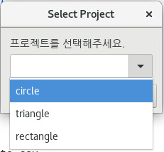
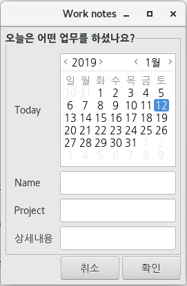

# Zenity
단순한 프로그램에 GUI를 처리해야하는 상황이라면 zenity를 추천합니다.
우리는 간혹 단순한 스크립트에 복잡한 GUI를 입히는 경우를 볼 수 있습니다.
유지보수 측면에서도 굉장히 비효율적입니다.

여러분의 스크립트가 아주 단순하다면 그에 걸맞는 GUI툴 Zenity를 사용해보세요.

## 사용법
CentOS7.6에 설치된 Zenity는 3.28.1 입니다. 아래 명령어를 이용해서 터미널에서 버전을 체크해봅시다.

```bash
$ zenity --version
```

진행률 처리
```bash
$ cp -f ~/examples/FOO_0010/*.jpg /tmp | tee >(zenity --progress --pulsate)
```
| tee 명령어는 stdout을 화면과 파일로 동시에 출력하는 리눅스 명령어 입니다.

선택창
```bash
ANS=$(zenity  --list  --text "어떤색을 좋아해요?" --checklist  --column "선택" --column "옵션" FALSE "흰색" TRUE "검정" --separator=":"); echo $ANS
```

리스트 선택



```bash
$ zenity --entry --title="Select Project" --text="프로젝트를 선택해주세요." circle triangle rectangle
```

## rename GUI
리눅스 rename 명령어를 쉽게 사용할 수 있도록 간단한 GUI를 입혀봅시다.

~/bin/renamegui
```bash
FIND=$(zenity --entry --title="Rename" --text="바꿀 문자열을 입력하세요.")
DST=$(zenity --entry --title="Rename" --text="바뀔 문자열을 입력하세요.")
rename $FIND $DST *
```

## Web컬러 가지고 오기
웹 컬러를 빠르게 확인하기 위해서 웹 컬러 Hex코드를 출력하는 명령어를 만들어봅시다.

~/bin/webcolor
```bash
STDIN=$(zenity --title "Pick a color" --color-selection 2> /dev/null)
SEQ=${STDIN//[rgb( )]}
NUM=${SEQ//,/ }
echo $STDIN
printf "#%02X%02X%02X\n" $NUM
```

## 실습) 어떤 프로젝트를 하셨나요?


위 형태의 소프트웨어를 간단하게 만들어보겠습니다.

```
#!/bin/sh

zenity --forms --title="Work notes" \
--text="오늘은 어떤 업무를 하셨나요?" \
--separator="," \
--add-calendar="Today" \ 
--add-entry="Name" \
--add-entry="Project" \
--add-entry="Note" >> worknote.csv

case $? in
	0)
		echo "done";;
	1)
		echo "cancel";;
	-1)
		echo "cancel";;
esac
```

자동으로 입력하거나 DB와 연동을 위해서는 위 스크립트로는 기능이 약하지만..
일단! 당장! 즉각! 무언가를 임시로 진행해야 할 때 zenity는 훌륭한 솔루션 입니다.

## 실습
- zenity + 리눅스 rename 명령어를 사용하여 리네임하는 GUI 프로그램을 만들어 봅시다.
- renamegui 명령어를 만들고 Github centos 리포지터리 bin에 등록합니다.
- webcolor 명령어를 만들고 Github centos 리포지터리 bin에 등록합니다.
- https://help.gnome.org/users/zenity/3.22/

## Reference
- https://linuxaria.com/howto/introduction-zenity-bash-gu